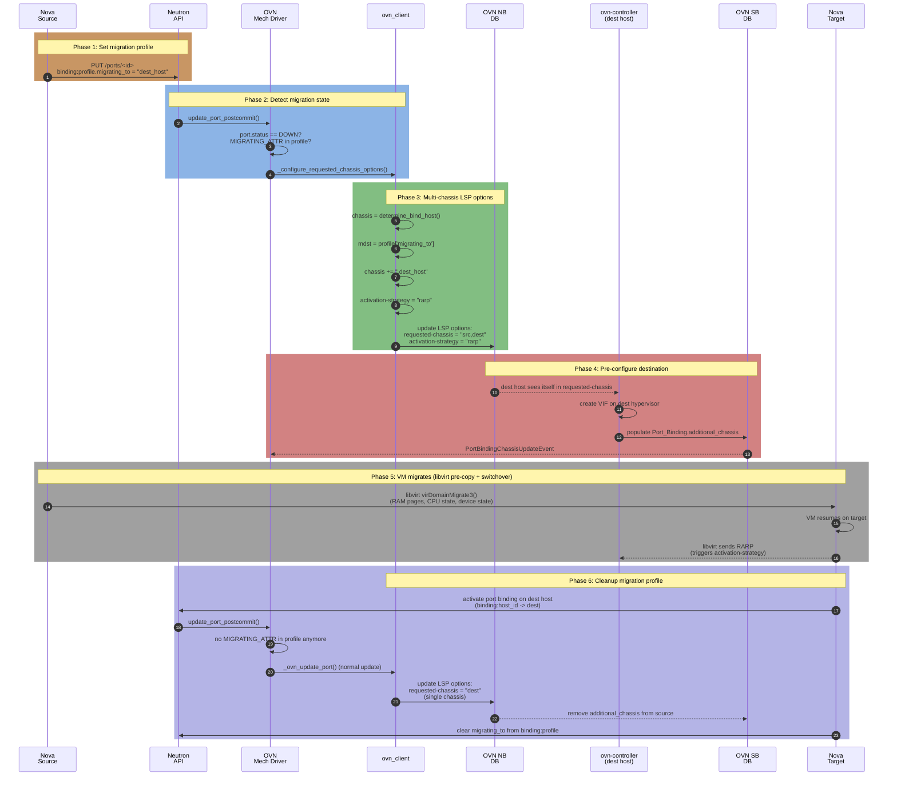

# OVN Migration Internals — How Open Virtual Network Handles Live Migration

Detailed research on how OVN (Open Virtual Network) is used during OpenStack instance migrations. Covers the end-to-end flow, code references, database changes, and configuration options.

---

## Table of Contents

1. [End-to-End Live Migration Flow with OVN](#1-end-to-end-live-migration-flow-with-ovn)
2. [Step-by-Step: What Each Component Does](#2-step-by-step-what-each-component-does)
   - [2.1 Nova: Sets `migrating_to` on Port Binding Profile](#21-nova-sets-migrating_to-on-port-binding-profile)
   - [2.2 Neutron OVN: Detects `MIGRATING_ATTR` on Port Update](#22-neutron-ovn-detects-migrating_attr-on-port-update)
   - [2.3 OVN Client: Configures `requested-chassis` for Multi-Chassis Binding](#23-ovn-client-configures-requested-chassis-for-multi-chassis-binding)
   - [2.4 OVN Controller: Populates `Port_Binding.additional_chassis`](#24-ovn-controller-populates-port_bindingadditional_chassis)
   - [2.5 Revision Conflict Retry During Migration](#25-revision-conflict-retry-during-migration)
   - [2.6 Nova: Clears `migrating_to` After Migration Completes](#26-nova-clears-migrating_to-after-migration-completes)
3. [OVN Database Changes During Migration](#3-ovn-database-changes-during-migration)
4. [Configuration Options](#4-configuration-options)
5. [Supported VIF Types and Behavior](#5-supported-vif-types-and-behavior)
6. [Constants Reference](#6-constants-reference)
7. [Source Code References](#7-source-code-references)
8. [Documentation Links](#8-documentation-links)
9. [Lab Verification Commands](#9-lab-verification-commands)

---

## 1. End-to-End Live Migration Flow with OVN



**Key insight**: OVN uses a multi-chassis approach. Before migration, both source and destination chassis are listed in `requested-chassis`. The destination port is pre-configured but blocked until the VM actually arrives (signaled via RARP). This allows asynchronous VIF plugging, eliminating the need for synchronous network calls during the migration pause window.

---

## 2. Step-by-Step: What Each Component Does

### 2.1 Nova: Sets `migrating_to` on Port Binding Profile

**File**: [`nova/network/neutron.py`](https://opendev.org/openstack/nova/src/branch/master/nova/network/neutron.py)
**Method**: `setup_networks_on_host()` -> [`_setup_migration_port_profile()`](https://opendev.org/openstack/nova/src/branch/master/nova/network/neutron.py#L318)

Before migration begins, Nova marks each port with the destination host:

```python
def _setup_migration_port_profile(
        self, context, instance, host, admin_client, ports):
    # Migrating to a new host
    for p in ports:
        host_id = p.get(constants.BINDING_HOST_ID)
        if host_id != host:
            port_profile = get_binding_profile(p)
            if host != port_profile.get(constants.MIGRATING_ATTR):
                port_profile[constants.MIGRATING_ATTR] = host
                self._update_port_with_migration_profile(
                    instance, p['id'], port_profile, admin_client)
```

**What this does**:
- Iterates over all ports attached to the instance
- For each port where `binding:host_id != target_host`, sets `binding:profile.migrating_to = "<target_host>"`
- Calls Neutron API `PUT /v2.0/ports/<id>` with updated `binding:profile`

**Result in Neutron DB**:
```json
{
  "port": {
    "binding:profile": {
      "migrating_to": "compute-dest-hostname"
    }
  }
}
```

**Method**: [`_clear_migration_port_profile()`](https://opendev.org/openstack/nova/src/branch/master/nova/network/neutron.py#L302)
After migration finishes, Nova removes `migrating_to` from the profile:

```python
def _clear_migration_port_profile(
        self, context, instance, admin_client, ports):
    for p in ports:
        port_profile = get_binding_profile(p)
        if not port_profile:
            continue
        if constants.MIGRATING_ATTR in port_profile:
            del port_profile[constants.MIGRATING_ATTR]
            self._update_port_with_migration_profile(
                instance, p['id'], port_profile, admin_client)
```

**Method**: [`_update_port_with_migration_profile()`](https://opendev.org/openstack/nova/src/branch/master/nova/network/neutron.py#L289)
The actual Neutron API call to update the port:

```python
def _update_port_with_migration_profile(
        self, instance, port_id, port_profile, admin_client):
    try:
        updated_port = admin_client.update_port(
            port_id, {'port': {constants.BINDING_PROFILE: port_profile}})
        return updated_port
    except Exception as ex:
        with excutils.save_and_reraise_exception():
            LOG.error("Unable to update binding profile "
                      "for port: %(port)s due to failure: %(error)s",
                      {'port': port_id, 'error': ex}, instance=instance)
```

**Nova Constant**:
```python
# nova/network/constants.py:26
MIGRATING_ATTR = 'migrating_to'
```

---

### 2.2 Neutron OVN: Detects `MIGRATING_ATTR` on Port Update

**File**: [`neutron/plugins/ml2/drivers/ovn/mech_driver/mech_driver.py`](https://opendev.org/openstack/neutron/src/commit/a6c4f5ed5cacf4d0fafd36422705f633a3bfac71/neutron/plugins/ml2/drivers/ovn/mech_driver/mech_driver.py)
**Method**: [`update_port_postcommit()`](https://opendev.org/openstack/neutron/src/commit/a6c4f5ed5cacf4d0fafd36422705f633a3bfac71/neutron/plugins/ml2/drivers/ovn/mech_driver/mech_driver.py#L1036)

When Neutron receives the port update from Nova, the OVN mechanism driver checks for migration state:

```python
def update_port_postcommit(self, context):
    port = copy.deepcopy(context.current)
    port['network'] = context.network.current
    original_port = copy.deepcopy(context.original)
    original_port['network'] = context.network.current

    # NOTE(mjozefcz,shoffmann): Check if port is in migration state.
    # This is needed to perform live-migration with the Nova configuration
    # flag ``live_migration_wait_for_vif_plug=True``.
    if (port['status'] == const.PORT_STATUS_DOWN and
            ovn_const.MIGRATING_ATTR in port[portbindings.PROFILE].keys()):
        # Three strategies based on VIF type:

        # Strategy 1: VIF_TYPE_UNBOUND - port will be rebound, continue normally
        if port[portbindings.VIF_TYPE] == portbindings.VIF_TYPE_UNBOUND:
            pass

        # Strategy 2: ovs_create_tap=True + VIF_TYPE_OVS
        # Wait for real PortBindingChassisUpdateEvent from SB DB
        elif (ovn_conf.is_ovs_create_tap() and
                port[portbindings.VIF_TYPE] == portbindings.VIF_TYPE_OVS):
            return  # Don't update; wait for Southbound event

        # Strategy 3: ovs_create_tap=False or VIF_TYPE_VHOST_USER
        # Generate "fake" vif-interface-plugged event
        elif (not ovn_conf.is_ovs_create_tap() or
                port[portbindings.VIF_TYPE] ==
                portbindings.VIF_TYPE_VHOST_USER):
            LOG.info("Setting port %s status from DOWN to UP in order "
                     "to emit vif-interface-plugged event.",
                     port['id'])
            self._plugin.update_port_status(context.plugin_context,
                                            port['id'],
                                            const.PORT_STATUS_ACTIVE)
            return  # Revision changed; skip OVN update

    # Normal path: update OVN with port changes
    self._ovn_update_port(context.plugin_context, port, original_port,
                          retry_on_revision_mismatch=True)
    self._notify_dhcp_updated(context.plugin_context, port['id'])
```

**Three strategies explained**:

| Strategy | Condition | Behavior |
|---|---|---|
| **1. Unbound** | `VIF_TYPE_UNBOUND` | Port will be re-bound normally; continue to `_ovn_update_port()` |
| **2. Wait for SB event** | `ovs_create_tap=True` + `VIF_TYPE_OVS` | Return early; wait for `PortBindingChassisUpdateEvent` from OVN Southbound DB signaling that `additional_chassis` is populated |
| **3. Fake plug event** | `ovs_create_tap=False` or `VIF_TYPE_VHOST_USER` | Artificially set port status to ACTIVE to emit a `vif-interface-plugged` Nova notification, bypassing the SB event wait |

---

### 2.3 OVN Client: Configures `requested-chassis` for Multi-Chassis Binding

**File**: [`neutron/plugins/ml2/drivers/ovn/mech_driver/ovsdb/ovn_client.py`](https://opendev.org/openstack/neutron/src/commit/a6c4f5ed5cacf4d0fafd36422705f633a3bfac71/neutron/plugins/ml2/drivers/ovn/mech_driver/ovsdb/ovn_client.py)
**Method**: [`_configure_requested_chassis_options()`](https://opendev.org/openstack/neutron/src/commit/a6c4f5ed5cacf4d0fafd36422705f633a3bfac71/neutron/plugins/ml2/drivers/ovn/mech_driver/ovsdb/ovn_client.py#L518)

This is the core OVN migration logic. When a port has `migrating_to` in its profile, OVN sets up a multi-chassis binding:

```python
def _configure_requested_chassis_options(self, options, port):
    options = copy.deepcopy(options)
    chassis = utils.determine_bind_host(self._sb_idl, port)
    if chassis:
        # Since version 22.09.0, OVN supports multi-chassis port bindings,
        # used for live migration to asynchronously configure
        # destination port while VM is migrating.
        mdst = port.get(
            portbindings.PROFILE, {}).get(ovn_const.MIGRATING_ATTR)
        if mdst:
            # Let OVN know that the port should be configured on
            # destination too
            chassis += ',%s' % mdst
            # Block traffic on destination host until libvirt sends
            # a RARP packet from it to inform network about the new
            # location of the port
            if (port[portbindings.VIF_TYPE] !=
                    portbindings.VIF_TYPE_VHOST_USER):
                strategy = ovn_conf.get_ovn_lm_activation_strategy()
                if strategy:
                    options['activation-strategy'] = strategy
        options[ovn_const.LSP_OPTIONS_REQUESTED_CHASSIS_KEY] = chassis
    return options
```

**What this does**:

1. **Determines current chassis** from the Southbound DB (where the port is currently bound)
2. **Reads `migrating_to`** from `binding:profile` — this is the target host
3. **Sets `requested-chassis`** to `"src_host,dest_host"` (comma-separated list)
4. **Sets `activation-strategy`** to `"rarp"` (default) — blocks traffic on destination until the VM sends a RARP

**Result in OVN Northbound DB**:
```
Logical_Switch_Port <port_uuid>
  options:
    requested-chassis: "compute-src.example.com,compute-dest.example.com"
    activation-strategy: "rarp"
```

**Called from**: `_get_port_options()` which is invoked during `update_port()` and handles all LSP option configuration.

**Requirement**: OVN **22.09.0+** for multi-chassis port bindings. Before this version, ports could only be bound to a single chassis.

---

### 2.4 OVN Controller: Populates `Port_Binding.additional_chassis`

**OVN Component**: `ovn-controller` (runs on each hypervisor)
**OVN SB Table**: `Port_Binding`

When the OVN Northbound DB has `requested-chassis` set with multiple chassis:

1. **Source `ovn-controller`**: Already has the port bound (existing `Port_Binding` entry)
2. **Destination `ovn-controller`**: Sees itself in `requested-chassis`, creates VIF, populates `Port_Binding.additional_chassis`
3. **OVN Southbound DB**: Emits `PortBindingChassisUpdateEvent` notification

**`Port_Binding` table structure** (Southbound DB):
```
Port_Binding <logical_port>
  chassis: <source_chassis_uuid>          # Primary chassis
  additional_chassis:                     # Populated during migration
    - <destination_chassis_uuid>
  requested_chassis: <src_uuid>,<dst_uuid>  # From NB LSP options
```

**During migration, the flow is**:

```
Time ──────────────────────────────────────────────────────────►

Pre-migration:
  Port_Binding.chassis = [src]
  Port_Binding.additional_chassis = []

Migration starts (migrating_to set):
  OVN NB: requested-chassis = "src,dest"
  OVN SB: ovn-controller on dest sees itself in requested-chassis
  OVN SB: dest creates VIF, populates additional_chassis = [dest]
  OVN SB: emits PortBindingChassisUpdateEvent

Migration completes (VM on dest, libvirt sends RARP):
  OVN SB: activation-strategy fires, dest traffic now active
  Neutron: clears migrating_to from profile
  OVN NB: requested-chassis = "dest" (single chassis)
  OVN SB: source unbound, only dest in chassis
```

---

### 2.5 Revision Conflict Retry During Migration

**File**: [`neutron/plugins/ml2/drivers/ovn/mech_driver/mech_driver.py`](https://opendev.org/openstack/neutron/src/commit/a6c4f5ed5cacf4d0fafd36422705f633a3bfac71/neutron/plugins/ml2/drivers/ovn/mech_driver/mech_driver.py)
**Method**: [`_ovn_update_port()`](https://opendev.org/openstack/neutron/src/commit/a6c4f5ed5cacf4d0fafd36422705f633a3bfac71/neutron/plugins/ml2/drivers/ovn/mech_driver/mech_driver.py#L951)

During migration, a race condition can occur between:
- OVN reporting the port DOWN on the source (triggers revision number change)
- Nova activating the port binding on the destination (triggers another revision change)

The OVN driver handles this with a retry:

```python
def _ovn_update_port(self, plugin_context, port, original_port,
                     retry_on_revision_mismatch):
    try:
        self._ovn_client.update_port(plugin_context, port,
                                     port_object=original_port)
    except ovn_exceptions.RevisionConflict:
        if retry_on_revision_mismatch:
            # NOTE(slaweq): I know this is a terrible hack but there is no
            # other way to workaround possible race between port update
            # event from the OVN (port down on the src node) and API
            # request from nova-compute to activate binding of the port on
            # the dest node.
            original_port_migrating_to = original_port.get(
                portbindings.PROFILE, {}).get('migrating_to')
            port_host_id = port.get(portbindings.HOST_ID)
            if (original_port_migrating_to is not None and
                    original_port_migrating_to == port_host_id):
                LOG.debug("Revision number of the port %s has changed "
                          "probably during live migration. Retrying "
                          "update port in OVN.", port)
                db_port = self._plugin.get_port(plugin_context,
                                                port['id'])
                port['revision_number'] = db_port['revision_number']
                self._ovn_update_port(plugin_context, port, original_port,
                                      retry_on_revision_mismatch=False)
    except ovn_revision_numbers_db.StandardAttributeIDNotFound:
        LOG.debug("Standard attribute was not found for port %s. It was "
                  "possibly deleted concurrently.", port['id'])
```

**Logic**:
1. Attempt to update port in OVN NB DB
2. If `RevisionConflict` is raised (OVN's revision number doesn't match Neutron's):
   - Check if the original port had `migrating_to` set to the current port's host
   - If yes, this is a migration-related race -> fetch the latest `revision_number` from Neutron DB and retry **once**
   - If no, let the exception propagate (genuine conflict)

---

### 2.6 Nova: Clears `migrating_to` After Migration Completes

**File**: [`nova/network/neutron.py`](https://opendev.org/openstack/nova/src/branch/master/nova/network/neutron.py)
**Method**: [`setup_networks_on_host()`](https://opendev.org/openstack/nova/src/branch/master/nova/network/neutron.py#L343) with `teardown=True`

After [`migrate_instance_finish()`](https://opendev.org/openstack/nova/src/branch/master/nova/network/neutron.py#L3248), Nova calls [`setup_networks_on_host()`](https://opendev.org/openstack/nova/src/branch/master/nova/network/neutron.py#L343) with `teardown=True` to clean up:

```python
def setup_networks_on_host(self, context, instance, host=None,
                           teardown=False):
    port_migrating = host and (instance.host != host)
    if port_migrating or teardown:
        search_opts = {'device_id': instance.uuid,
                       'tenant_id': instance.project_id,
                       constants.BINDING_HOST_ID: instance.host}
        data = self.list_ports(context, **search_opts)
        ports = data['ports']
        admin_client = get_client(context, admin=True)
        if teardown:
            # Reset the port profile - clears migrating_to
            self._clear_migration_port_profile(
                context, instance, admin_client, ports)
            # Delete port bindings on source host if different
            if port_migrating and has_binding_ext:
                self._delete_port_bindings(context, ports, host)
        elif port_migrating:
            # Setup the port profile - sets migrating_to
            self._setup_migration_port_profile(
                context, instance, host, admin_client, ports)
```

**Cleanup sequence**:
1. [`_clear_migration_port_profile()`](https://opendev.org/openstack/nova/src/branch/master/nova/network/neutron.py#L302) removes `migrating_to` from `binding:profile`
2. If port binding extension is available, [`_delete_port_bindings()`](https://opendev.org/openstack/nova/src/branch/master/nova/network/neutron.py#L391) removes the binding on the source host
3. OVN driver sees the cleared profile and updates `requested-chassis` back to single chassis

---

## 3. OVN Database Changes During Migration

### Northbound DB (`ovn-nb`)

**Before migration** (VM running on source only):
```
Logical_Switch_Port <uuid>
  name: "<neutron_port_id>"
  options:
    requested-chassis: "compute-src"
```

**During migration** (migrating_to set, pre-copy phase):
```
Logical_Switch_Port <uuid>
  name: "<neutron_port_id>"
  options:
    requested-chassis: "compute-src,compute-dest"
    activation-strategy: "rarp"
```

**After migration** (VM on destination, source cleaned up):
```
Logical_Switch_Port <uuid>
  name: "<neutron_port_id>"
  options:
    requested-chassis: "compute-dest"
```

### Southbound DB (`ovn-sb`)

**Before migration**:
```
Port_Binding <logical_port>
  chassis: <src_chassis_uuid>
  additional_chassis: []
```

**During migration**:
```
Port_Binding <logical_port>
  chassis: <src_chassis_uuid>
  additional_chassis:
    - <dest_chassis_uuid>
```

**After migration**:
```
Port_Binding <logical_port>
  chassis: <dest_chassis_uuid>
  additional_chassis: []
```

---

## 4. Configuration Options

### Nova Configuration (`nova.conf`)

| Option | Section | Default | Description |
|---|---|---|---|
| `live_migration_wait_for_vif_plug` | `[DEFAULT]` | `False` | Wait for Neutron `vif-plugged` event before proceeding with migration. Must be `True` for OVN live migration to work correctly |
| `live_migration_downtime` | `[libvirt]` | `500` | Max downtime per step (ms) during iterative pre-copy |
| `live_migration_bandwidth` | `[libvirt]` | `0` | Max bandwidth for memory transfer (MB/s). 0 = unlimited |
| `live_migration_permit_post_copy` | `[libvirt]` | `False` | Enable post-copy migration |
| `live_migration_permit_auto_converge` | `[libvirt]` | `False` | Enable auto-convergence |

**Doc**: https://docs.openstack.org/nova/latest/configuration/config.html

### Neutron OVN Configuration (`neutron.conf` / `ovn.ini`)

| Option | Section | Default | Description |
|---|---|---|---|
| `ovs_create_tap` | `[ovn]` | `True` | Whether OVS creates TAP interfaces. If False, OVN creates a fake `vif-plugged` event during migration |
| `ovn_lm_activation_strategy` | `[ovn]` | `rarp` | Activation strategy for migration. Options: `rarp`, `disabled`. `rarp` blocks dest traffic until VM sends RARP |
| `ovn_ovsdb_connection` | `[ovn]` | `tcp:127.0.0.1:6641` | OVN NB DB connection string |
| `ovn_sb_connection` | `[ovn]` | `tcp:127.0.0.1:6642` | OVN SB DB connection string |

**Doc**: https://docs.openstack.org/neutron/latest/configuration/ovn.html

### OVN Version Requirements

| Feature | Minimum OVN Version |
|---|---|
| Multi-chassis port bindings (`requested-chassis`) | **22.09.0** |
| `activation-strategy` (RARP-based activation) | **22.09.0** |
| `Port_Binding.additional_chassis` | **22.09.0** |

---

## 5. Supported VIF Types and Behavior

| VIF Type | `ovs_create_tap` | Migration Strategy |
|---|---|---|
| `VIF_TYPE_OVS` | `True` | Wait for `PortBindingChassisUpdateEvent` from SB DB (strategy 2) |
| `VIF_TYPE_OVS` | `False` | Generate fake `vif-interface-plugged` event (strategy 3) |
| `VIF_TYPE_VHOST_USER` | N/A | Generate fake event (strategy 3); **no** `activation-strategy` (DPDK bug) |
| `VIF_TYPE_UNBOUND` | N/A | Continue normally; port will be rebound (strategy 1) |

**DPDK note**: `VIF_TYPE_VHOST_USER` ports do not set `activation-strategy` due to [OVN bug 2092407](https://bugs.launchpad.net/neutron/+bug/2092407) where OVN does not properly support activation for DPDK ports.

---

## 6. Constants Reference

| Constant | Value | File |
|---|---|---|
| `MIGRATING_ATTR` | `'migrating_to'` | [`neutron/common/ovn/constants.py`](https://opendev.org/openstack/neutron/src/branch/master/neutron/common/ovn/constants.py#L63) |
| `MIGRATING_ATTR` (Nova) | `'migrating_to'` | [`nova/network/constants.py`](https://opendev.org/openstack/nova/src/branch/master/nova/network/constants.py#L26) |
| `LSP_OPTIONS_REQUESTED_CHASSIS_KEY` | `'requested-chassis'` | [`neutron/common/ovn/constants.py`](https://opendev.org/openstack/neutron/src/branch/master/neutron/common/ovn/constants.py#L420) |
| `OVN_DATAPATH_TYPE` | `'datapath-type'` | [`neutron/common/ovn/constants.py`](https://opendev.org/openstack/neutron/src/branch/master/neutron/common/ovn/constants.py#L80) |
| `CHASSIS_DATAPATH_NETDEV` | `'netdev'` | [`neutron/common/ovn/constants.py`](https://opendev.org/openstack/neutron/src/branch/master/neutron/common/ovn/constants.py#L249) |
| `OVN_SUPPORTED_VNIC_TYPES` | `[...]` | [`neutron/common/ovn/constants.py`](https://opendev.org/openstack/neutron/src/branch/master/neutron/common/ovn/constants.py#L495) |

---

## 7. Source Code References

### Nova

| File | Method/Function | Description |
|---|---|---|
| `nova/network/neutron.py` | `setup_networks_on_host()` | Orchestrates migration profile setup/teardown |
| `nova/network/neutron.py` | `_setup_migration_port_profile()` | Sets `migrating_to` on port binding profile |
| `nova/network/neutron.py` | `_clear_migration_port_profile()` | Removes `migrating_to` after migration |
| `nova/network/neutron.py` | `_update_port_with_migration_profile()` | Calls Neutron API to update `binding:profile` |
| `nova/network/neutron.py` | `_delete_port_bindings()` | Deletes source host port bindings |
| `nova/network/constants.py` | `MIGRATING_ATTR` | Constant definition (`'migrating_to'`) |
| `nova/virt/libvirt/driver.py` | `_live_migration_operation()` | Live migration orchestration (libvirt-agnostic) |

**Raw sources**:
- https://raw.githubusercontent.com/openstack/nova/master/nova/network/neutron.py
- https://raw.githubusercontent.com/openstack/nova/master/nova/network/constants.py

### Neutron (OVN Driver)

| File | Method/Function | Description |
|---|---|---|
| `neutron/plugins/ml2/drivers/ovn/mech_driver/mech_driver.py` | `update_port_postcommit()` | Detects `MIGRATING_ATTR`, chooses strategy |
| `neutron/plugins/ml2/drivers/ovn/mech_driver/mech_driver.py` | `_ovn_update_port()` | Revision conflict retry during migration |
| `neutron/plugins/ml2/drivers/ovn/mech_driver/ovsdb/ovn_client.py` | `_configure_requested_chassis_options()` | Sets `requested-chassis` + `activation-strategy` |
| `neutron/plugins/ml2/drivers/ovn/mech_driver/ovsdb/ovn_client.py` | `update_lsp_host_info()` | Updates LSP host info in external_ids |
| `neutron/plugins/ml2/drivers/ovn/mech_driver/mech_driver.py` | `set_port_status_up()` | Handles port UP from OVN SB |
| `neutron/plugins/ml2/drivers/ovn/mech_driver/mech_driver.py` | `set_port_status_down()` | Handles port DOWN from OVN SB |
| `neutron/common/ovn/constants.py` | `MIGRATING_ATTR` | Constant definition |
| `neutron/common/ovn/constants.py` | `LSP_OPTIONS_REQUESTED_CHASSIS_KEY` | Constant definition |
| `neutron/conf/plugins/ml2/drivers/ovn/ovn_conf.py` | `is_ovs_create_tap()` | Config flag for VIF creation strategy |
| `neutron/conf/plugins/ml2/drivers/ovn/ovn_conf.py` | `get_ovn_lm_activation_strategy()` | Config flag for activation strategy |

**Raw sources**:
- https://raw.githubusercontent.com/openstack/neutron/master/neutron/plugins/ml2/drivers/ovn/mech_driver/mech_driver.py
- https://raw.githubusercontent.com/openstack/neutron/master/neutron/plugins/ml2/drivers/ovn/mech_driver/ovsdb/ovn_client.py
- https://raw.githubusercontent.com/openstack/neutron/master/neutron/common/ovn/constants.py

### OVN Upstream

| File/Project | Description |
|---|---|
| `ovn-org/ovn` | OVN core (NB/SB schemas, ovn-controller, ovn-northd) |
| OVN NB Schema | `Logical_Switch_Port.options.requested-chassis` |
| OVN NB Schema | `Logical_Switch_Port.options.activation-strategy` |
| OVN SB Schema | `Port_Binding.additional_chassis` |

**Source**: https://github.com/ovn-org/ovn

---

## 8. Documentation Links

### OpenStack Official

| Topic | URL |
|---|---|
| Nova live migration | https://docs.openstack.org/nova/latest/admin/live-migration-usage.html |
| Nova migration configuration | https://docs.openstack.org/nova/latest/admin/configuring-migrations.html |
| Nova configuration reference | https://docs.openstack.org/nova/latest/configuration/config.html |
| Neutron OVN driver | https://docs.openstack.org/neutron/latest/ovn/index.html |
| Neutron OVN FAQ | https://docs.openstack.org/neutron/latest/ovn/faq/index.html |
| Neutron OVN gaps from ML2/OVS | https://docs.openstack.org/neutron/latest/ovn/gaps.html |
| Neutron OVN agent | https://docs.openstack.org/neutron/latest/ovn/ovn_agent.html |
| Neutron configuration reference | https://docs.openstack.org/neutron/latest/configuration/ |

### OVN Upstream

| Topic | URL |
|---|---|
| OVN architecture | https://www.ovn.org/en/architecture/ |
| OVN documentation | https://docs.ovn.org/ |
| OVN releases | https://www.ovn.org/en/releases/ |
| OVN GitHub | https://github.com/ovn-org/ovn |
| OVS documentation | https://docs.openvswitch.org/en/latest/ |

### Code Repositories

| Repository | URL |
|---|---|
| Nova (OpenStack) | https://opendev.org/openstack/nova |
| Neutron (OpenStack) | https://opendev.org/openstack/neutron |
| Neutron OVN driver (within Neutron) | https://opendev.org/openstack/neutron/src/branch/master/neutron/plugins/ml2/drivers/ovn |
| Networking-OVN (archived) | https://github.com/openstack-archive/networking-ovn |
| OVN upstream | https://github.com/ovn-org/ovn |
| Open vSwitch | https://github.com/openvswitch/ovs |

### Relevant RFEs and Bugs

| Issue | Description |
|---|---|
| [LP #2020058](https://bugs.launchpad.net/neutron/+bug/2020058) | LSP host info update during migration |
| [LP #2092407](https://bugs.launchpad.net/neutron/+bug/2092407) | OVN activation of DPDK ports not properly supported |
| [OVS Discuss (Feb 2022)](https://mail.openvswitch.org/pipermail/ovs-discuss/2022-February/051808.html) | Multi-chassis port bindings RFC |

---

## 9. Lab Verification Commands

Commands to inspect OVN state on MicroStack controllers during migration tests:

```bash
# SSH into a controller
ssh -F /opt/lab/ssh_config lab-controller-01

# Check OVN and OVS versions
sudo ovs-vsctl --version
sudo ovn-nbctl --version
sudo ovn-sbctl --version

# List all logical switch ports
sudo ovn-nbctl show

# Show a specific LSP (port) with its options
sudo ovn-nbctl list Logical_Switch_Port <neutron_port_id>

# Check requested-chassis and activation-strategy
sudo ovn-nbctl get Logical_Switch_Port <neutron_port_id> options:requested-chassis
sudo ovn-nbctl get Logical_Switch_Port <neutron_port_id> options:activation-strategy

# List chassis (hypervisors) in Southbound DB
sudo ovn-sbctl list Chassis

# Show port bindings
sudo ovn-sbctl list Port_Binding

# Show a specific port binding (check additional_chassis)
sudo ovn-sbctl find Port_Binding logical_port=<neutron_port_id>

# List OVN chassis on each controller
sudo ovn-sbctl show

# Check OVN NB and SB connection strings
sudo ovn-nbctl get-connection
sudo ovn-sbctl get-connection

# View OVS bridges and ports
sudo ovs-vsctl show

# Check OpenFlow rules for a specific bridge
sudo ovs-ofctl dump-flows br-int

# Neutron port details (from within controller)
microstack.openstack port show <port_id>
microstack.openstack port show <port_id> -c binding:profile -c binding:host_id -c status

# Check Nova instance migration state
microstack.openstack server show <instance_id> -c OS-EXT-SRV-ATTR:host -c status
```

**Note**: MicroStack uses the `microstack.openstack` prefix for CLI commands. For direct OVN/OVS commands, use `sudo ovn-nbctl`, `sudo ovs-vsctl`, etc.
