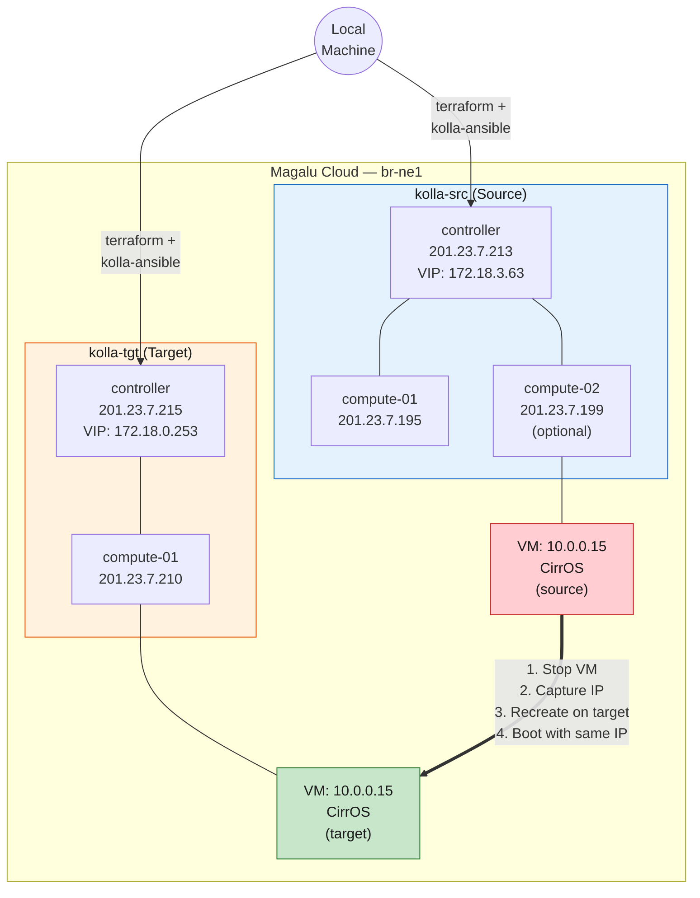
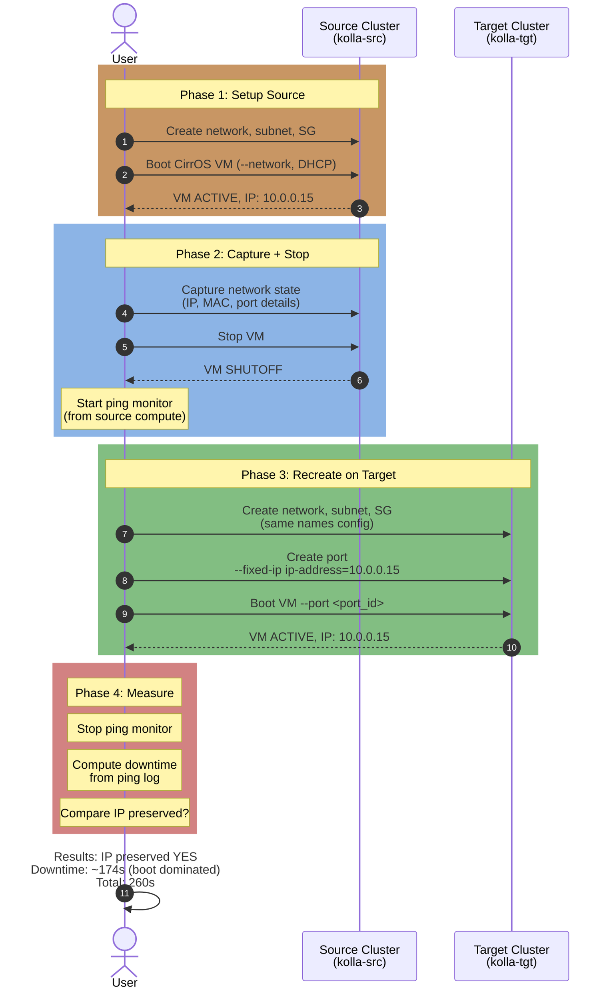

# Kolla-Ansible Migration Test — Plan & Approach

Plano e resultado do teste de migracao de rede entre dois clusters Kolla-Ansible independentes na MGC.

---

## 1. Por que Kolla-Ansible?

MicroStack Ussuri tem `br-int` DOWN, bloqueando conectividade de rede das VMs (ver [`network_issue.md`](network_issue.md)). Kolla-Ansible ja foi validado na MGC com o workaround `fail_mode=standalone` e tem OVS funcional.

## 2. Abordagem Final: 2 Clusters Multi-Node Independentes

Abordagem inicial (jumphost + all-in-one) foi abandonada por complexidade desnecessaria. A abordagem final usa **dois deploys independentes** via Terraform, cada um com controller + compute(s):



**Cada cluster** e um deploy Kolla-Ansible multi-node padrao (1 controller + N computes). Terraform cria as VMs, `deploy.sh` configura e deploya o Kolla.

## 3. Migration Flow



## 4. Deploy Architecture

```
openstack-mgc-deploy/kolla-ansible/
├── kolla-ansible-mgc-deploy/     # Original multi-node (reference)
│   ├── main.tf / variables.tf
│   └── deploy.sh
│
└── kolla-cluster/                # Dual-cluster migration setup
    ├── kolla-cluster-source/     # Source OpenStack
    │   ├── main.tf               # 2 VMs: controller + compute-01
    │   ├── variables.tf          # cluster_prefix: "kolla-src"
    │   ├── deploy.sh             # Installs Docker + runs kolla-ansible deploy
    │   ├── gen_inventory.py      # Generates Ansible inventory from TF output
    │   └── scripts/
    │       └── migrate-kolla.sh  # Migration test script
    │
    └── kolla-cluster-target/     # Target OpenStack
        ├── main.tf               # 2 VMs: controller + compute-01
        ├── variables.tf          # cluster_prefix: "kolla-tgt"
        └── deploy.sh
```

## 5. Script: migrate-kolla.sh

O script (`kolla-cluster-source/scripts/migrate-kolla.sh`) automatiza todo o fluxo:

1. **Pre-checks**: verifica `openstack token issue` em ambos clusters
2. **Setup source**: network → subnet → SG → boot VM → captura IP
3. **Stop + ping**: stop VM, inicia ping monitor no compute
4. **Recreate target**: network → subnet → SG → port (`--fixed-ip`) → boot VM
5. **Measure**: para ping, calcula downtime, gera relatorio

**Key implementation details**:
- Usa `docker exec kolla_toolbox openstack` nos controllers (API so no IP interno)
- Timestamps via `date +%s` para medir cada fase
- Recursos com nome unico por run (`$TIMESTAMP`) -- idempotente
- Ping via SSH no compute node (`ping -i 0.2 -c 200`)

## 6. Diferencas do MicroStack

| Aspecto | MicroStack | Kolla-Ansible |
|---|---|---|
| CLI | `microstack.openstack` | `openstack` (via kolla_toolbox container) |
| Services | Snap + systemd | Docker containers |
| Credentials | `snap get microstack config.credentials.keystone-password` | `/etc/kolla/passwords.yml` (local) |
| OVS fix | Nao aplicado (br-int DOWN) | `fail_mode=standalone` + Docker exec |
| Network | 1 NIC (ens3) | 2 NICs (ens3 + ens8 for Neutron external) |
| CirrOS | Pre-instalado | Download + upload manual |
| Deploy model | Jumphost provisions | Terraform direct per cluster |
| VM count per cluster | 1 (all-in-one) | 2 (controller + compute) |

## 7. Estimated vs Actual Timing

| Etapa | Estimado | Real (run 20260802-225413) |
|---|---|---|
| Terraform (criar VMs) | ~5 min | ~5 min |
| Cloud-init (Docker + deps) | ~5 min | ~3 min |
| Kolla-Ansible bootstrap + deploy | ~15 min | ~12 min |
| Post-deploy + OVS fix | ~2 min | ~1 min |
| **Total por cluster** | **~25 min** | **~20 min** |
| Migrate script execution | ~5 min | **260s (~4.3 min)** |
| **Total do teste** | **~60 min** | **~45 min** |

## 8. Key Findings

Ver [`kolla-migration-findings.md`](kolla-migration-findings.md) para resultados detalhados.

| Aspect | Result |
|---|---|
| IP preservation | **YES** |
| Network downtime | ~174s (VM boot dominated) |
| Migration repeatable | Yes (4 runs executed) |
| VM connectivity (ping) | No (CirrOS limitation) |
| Cross-cluster automation | Yes (`migrate-kolla.sh`) |
| Lessons learned | 12 documented |
