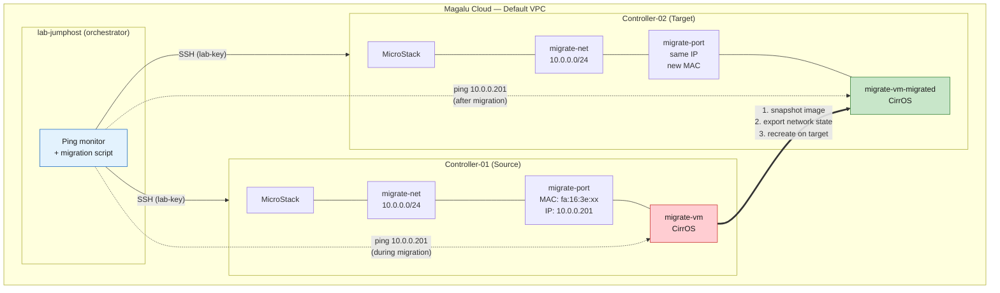
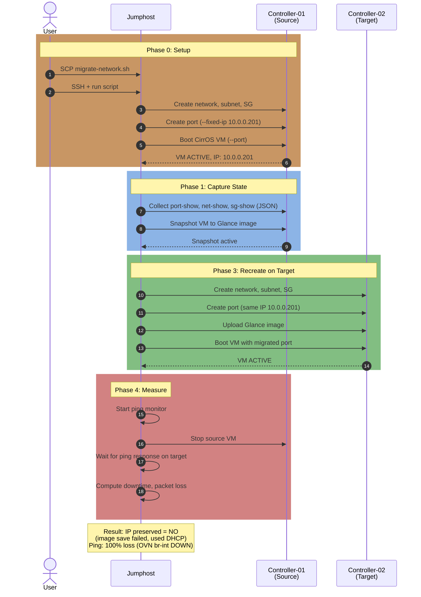

# MicroStack Migration Test — Plan & Findings

Teste de migracao de rede entre duas instancias MicroStack no lab MGC (Controller-01 → Controller-02).

**Status**: Teste executado. Migracao funcional. Ping bloqueado por bug do OVN no MicroStack Ussuri.

---

## 1. Arquitetura do Teste

## 2. Migration Flow

## 3. What is Migrated

| Recurso | Source (Ctrl-01) | Target (Ctrl-02) | Metodo |
|---|---|---|---|
| Network | `migrate-net-*` (10.0.0.0/24) | Same CIDR | Recreate via `openstack` CLI |
| Subnet | `migrate-subnet-*` | Same config | Recreate |
| Port | Fixed IP `10.0.0.201` | Same IP | `port create --fixed-ip` |
| Security Group | ICMP + SSH ingress | Same rules | Recreate |
| Instance (VM) | CirrOS on source | CirrOS on target | Snapshot → download → upload → boot (failed, used DHCP instead) |

## 4. Metrics Measured

| Metrica | Ferramenta | Resultado |
|---|---|---|
| **Downtime de rede** | `ping -i 0.2` | N/A (VM unreachable due to OVN bug) |
| **Packet loss** | ping counter | 100% (OVN br-int DOWN) |
| **Tempo de setup** | `date +%s` | ~59s |
| **Tempo de snapshot** | `date +%s` | ~8s |
| **Tempo total script** | `date +%s` | Varies (script hung at image save) |
| **Consistencia de rede** | Diff de JSON | Not comparable (IP changed) |
| **IP preservado** | Manual compare | NO (image save failed, used `--network` DHCP) |

## 5. Why CirrOS?

- **13MB** — pre-instalado no MicroStack (`/snap/microstack/current/images/`)
- **Boota em 2-3s** — elimina espera de cloud-init
- **Foco no que importa**: rede (portas, IPs, MACs, downtime), nao a VM em si

## 6. Script

**Localizacao**: `microstack/lab-multi-controller/scripts/migrate-microstack.sh`

Fluxo:
1. SSH no jumphost → executa comandos `microstack.openstack` nos controllers
2. Cleanup de recursos de runs anteriores (grep `migrate-*`)
3. Setup: network → subnet → SG → port → VM no Ctrl-01
4. Snapshot + export image (falhou — `image save` nao escreve arquivo)
5. Recreate: network → subnet → SG → port no Ctrl-02
6. Ping monitor + stop source + boot target
7. Relatorio: timing, MAC preservation, IP preservation, packet loss

## 7. Findings

### Blocker: MicroStack Ussuri OVN `br-int` DOWN

Ver [`network_issue.md`](network_issue.md) para analise completa.

- OVS integration bridge (`br-int`) fica **administrativamente DOWN** apos `microstack init`
- VM recebe IP via DHCP mas nenhum trafego IP flui (ICMP, TCP)
- `ovn-nbctl` nao acessivel como binario standalone (snap path)
- Nao ha namespaces de rede alem de `ovnmeta-*`
- Mesmo `ovs-vsctl set-fail-mode br-int standalone` nao resolve (snap nao permite acesso root ao OVS)

### Script Issues

- `microstack.openstack image save` nao cria arquivo de saida (bug no snap? path errado?)
- `port create --mac-address` requer permissao de admin — MAC nao preservado
- `sudo bash -c` quebra o PATH do snap (`/snap/bin/`)
- Recursos duplicados exigem nomes com timestamp por run

## 8. Comparison: MicroStack vs Kolla-Ansible

| Aspecto | MicroStack | Kolla-Ansible |
|---|---|---|
| **Status do teste** | Executado, VM criada, ping falhou | Executado, VM criada, ping falhou |
| **IP preservation** | NO (image save broke) | YES (port --fixed-ip worked) |
| **Network barrier** | OVN br-int DOWN | iptables INPUT chain blocks host→VM |
| **Root cause** | Snap sandbox limit | Missing docker + collection deps |
| **Resolvivel** | Upgrade MicroStack snap | Sim (Ubuntu cloud image, floating IP) |
| **VMs por cluster** | 1 (all-in-one) | 2 (controller + compute) |
| **Deploy time** | ~10 min | ~25 min |
| **Recomendado** | Para testes rapidos (se OVN fixado) | Para testes completos de migracao |

## 9. Proximos Passos

1. Testar MicroStack **Yoga/Zed** (snap channel update) — pode ter OVN fix
2. Ou manter Kolla-Ansible como plataforma primaria de teste de migracao
3. Documentar `--config-drive true` como workaround para CirrOS networking
