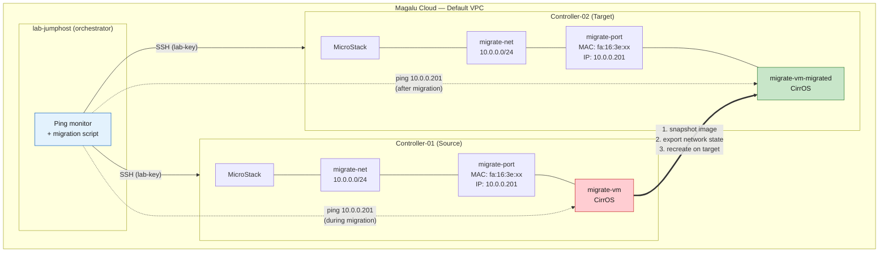

# Network Migration Test Plan — Controller-01 to Controller-02

Plano de execucao para testar migracao de rede entre duas instancias MicroStack no lab MGC.
Objetivo: migrar uma instancia (VM) do Controller-01 para o Controller-02, preservando configuracao
de rede (portas, IPs, MACs, security groups) e medindo downtime de rede.

---

## 1. Arquitetura do Teste



## 2. O que será migrado

| Recurso | Source (Ctrl-01) | Target (Ctrl-02) | Método |
|---|---|---|---|
| Network | `test-net` (10.0.0.0/24) | `test-net` (10.0.0.0/24) | Recriar com mesmo CIDR |
| Subnet | `test-subnet` | `test-subnet` | Recriar |
| Port | MAC: `fa:16:3e:xx:xx:xx`, IP: `10.0.0.201` | Mesmo MAC + IP | `port-create --mac-address --fixed-ip` |
| Security Group | `test-sg` (ICMP + SSH) | `test-sg` | Recriar regras |
| Instance (VM) | CirrOS `test-vm` | CirrOS `test-vm` | Snapshot Glance + nova boot |
| Floating IP | (opcional, se suportado) | Reassociar | `floatingip-disassociate` + `floatingip-associate` |

## 3. O que será medido

| Métrica | Ferramenta | Como |
|---|---|---|
| **Downtime de rede** | `ping -i 0.2 -D` | Ping contínuo com timestamp; contar segundos sem resposta |
| **Packet loss** | `ping` (contador final) | Pacotes perdidos / total |
| **Tempo total de migração** | `date +%s` no script | Timestamp início → fim de cada fase |
| **Tempo por fase** | `time` no script | Quanto tempo cada etapa leva |
| **Consistência de rede** | Diff de JSON | Comparar port-show antes/depois |

### Por que CirrOS?

- **13MB de imagem** — já vem pré-instalada no MicroStack (`/snap/microstack/current/images/`)
- **Boota em 2-3 segundos** — elimina espera de cloud-init, ideal para testes iterativos rápidos
- **Ping e SSH funcionam out-of-the-box** — sem configuração adicional
- **Login default**: `cirros` / `gocubsgo` (se precisar acessar)
- **Foco no que importa**: o teste é sobre **rede** (portas, IPs, MACs, downtime), não sobre a VM em si

## 4. Fases da Migração

### Fase -1: Pre-checks (Jumphost)
- Verificar SSH para ambos controllers
- Verificar MicroStack rodando em ambos (`snap services microstack | grep active`)
- Verificar CirrOS image disponível em ambos
- Verificar `m1.tiny` flavor existe em ambos

### Fase 0: Setup (Ctrl-01)
- Criar network `test-net` + subnet `test-subnet` (10.0.0.0/24)
- Criar security group `test-sg` (ICMP + SSH ingress)
- Criar port `test-port` com IP fixo `10.0.0.201`
- Boot CirrOS instance `test-vm` usando a port criada
- (Opcional) Criar floating IP e associar

### Fase 1: Captura de Estado (Ctrl-01)
- Coletar `port-show`, `net-show`, `subnet-show`, `sg-show`
- Salvar como JSON para referência
- Exportar Glance image (snapshot da VM)

### Fase 2: Início do Monitoramento (Jumphost)
- Iniciar ping contínuo com timestamp: `ping -i 0.2 -D 10.0.0.201`
- Marcar timestamp de início

### Fase 3: Transferência de Dados
- Download da Glance image do Ctrl-01 → jumphost → upload para Ctrl-02
- OU snapshot Cinder → transferir

### Fase 4: Recriação no Target (Ctrl-02)
- Criar network + subnet idênticos
- Criar security group com mesmas regras
- Criar port com mesmo MAC + IP fixo
- Boot instance com a imagem migrada + port

### Fase 5: Switchover de Rede
- Desassociar floating IP do Ctrl-01 (se houver)
- Reassociar floating IP no Ctrl-02 (se houver)
- Parar ping, calcular métricas

### Fase 6: Validação
- Comparar estado de rede antes/depois
- Testar conectividade (SSH, ping da nova VM)
- Verificar se MAC e IP foram preservados

## 5. Como Executar

### 5.1 Copiar script para o jumphost e executar

```bash
# Do seu computador local
JUMPHOST=$(terraform output -raw jumphost_public_ip)
scp -i ~/.ssh/id_rsa scripts/migrate-network.sh ubuntu@$JUMPHOST:~/

# SSH no jumphost e executar
ssh ubuntu@$JUMPHOST bash migrate-network.sh
```

O script faz tudo automaticamente: pre-checks, setup, migracao, medicao, relatorio.

```bash
# No jumphost, após migração:
cat /opt/lab/migration-results/migration-log.txt
cat /opt/lab/migration-results/ping-output.txt
cat /opt/lab/migration-results/metrics.txt
```

## 6. Script de Migração

Ver arquivo: `openstack-mgc-deploy/scripts/migrate-network.sh`

O script faz:
1. Captura estado de rede do Ctrl-01 (JSON)
2. Inicia ping contínuo com timestamp
3. Exporta Glance image da VM
4. Importa image no Ctrl-02
5. Recria network + subnet + security group + port no Ctrl-02
6. Boot instance no Ctrl-02
7. Para ping, calcula métricas
8. Gera relatório de comparação

## 7. Resultados Esperados

### O que deve funcionar
- Instance boota no Ctrl-02 com mesmo IP fixo
- MAC address preservado na port
- Security group rules idênticas
- Ping retorna após boot da nova VM

### O que pode falhar (limitações conhecidas)
- Floating IP não funciona entre MicroStacks diferentes (sem BGP/EVPN)
- CirrOS image pode precisar de configuração adicional de rede
- `port-create --mac-address` pode exigir permissões de admin

### O que observar (aprendizado)
- Tempo de cada fase
- Se o MAC foi realmente preservado
- Se houve perda de pacotes além do esperado
- Se a instância acessa a rede corretamente após migração

## 8. Métricas a Registrar

| Métrica | Formato | Exemplo |
|---|---|---|
| Timestamp início | Unix epoch | `1718400000` |
| Timestamp fim | Unix epoch | `1718400120` |
| Tempo total | segundos | `120s` |
| Tempo de snapshot | segundos | `15s` |
| Tempo de transferência | segundos | `45s` |
| Tempo de recriação | segundos | `30s` |
| Downtime de rede (ping) | segundos | `8.4s` |
| Pacotes enviados | int | `600` |
| Pacotes recebidos | int | `558` |
| Packet loss % | float | `7.0%` |
| MAC preservado? | bool | `true` |
| IP preservado? | bool | `true` |
