# OpenStack Inter-Cluster Migration Diagrams

Mermaid diagrams for all migration flows. View with any Mermaid-compatible renderer (GitHub, GitLab, VSCode, [mermaid.live](https://mermaid.live)).

---

## 1. Cold Migration (Shutdown-and-Transfer)

### 1.1 Sequence Diagram

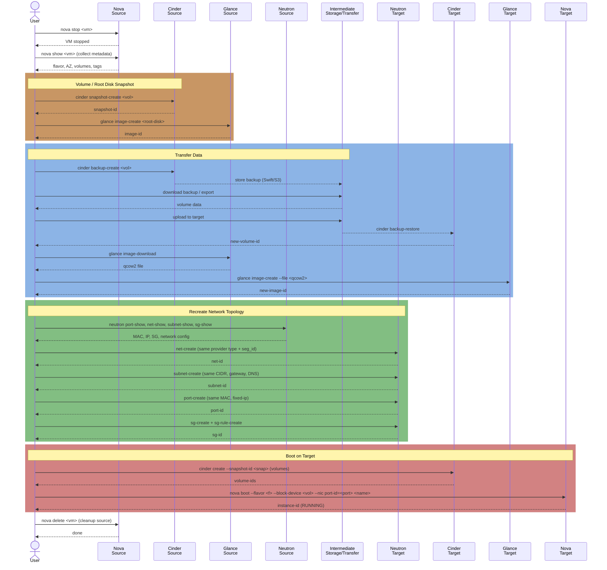
```mermaid
sequenceDiagram
    actor User
    participant NovaSrc as Nova<br/>Source
    participant CinderSrc as Cinder<br/>Source
    participant GlanceSrc as Glance<br/>Source
    participant NeutronSrc as Neutron<br/>Source
    participant Transfer as Intermediate<br/>Storage/Transfer
    participant NeutronTgt as Neutron<br/>Target
    participant CinderTgt as Cinder<br/>Target
    participant GlanceTgt as Glance<br/>Target
    participant NovaTgt as Nova<br/>Target

    User->>NovaSrc: nova stop <vm>
    NovaSrc-->>User: VM stopped

    User->>NovaSrc: nova show <vm> (collect metadata)
    NovaSrc-->>User: flavor, AZ, volumes, tags

    rect rgb(200, 150, 100)
        Note over User,CinderSrc: Volume / Root Disk Snapshot
        User->>CinderSrc: cinder snapshot-create <vol>
        CinderSrc-->>User: snapshot-id
        User->>GlanceSrc: glance image-create <root-disk>
        GlanceSrc-->>User: image-id
    end

    rect rgb(140, 180, 230)
        Note over User,Transfer: Transfer Data
        User->>CinderSrc: cinder backup-create <vol>
        CinderSrc-->>Transfer: store backup (Swift/S3)
        User->>Transfer: download backup / export
        Transfer-->>User: volume data
        User->>Transfer: upload to target
        Transfer-->>CinderTgt: cinder backup-restore
        CinderTgt-->>User: new-volume-id

        User->>GlanceSrc: glance image-download
        GlanceSrc-->>User: qcow2 file
        User->>GlanceTgt: glance image-create --file <qcow2>
        GlanceTgt-->>User: new-image-id
    end

    rect rgb(130, 190, 130)
        Note over User,NeutronTgt: Recreate Network Topology
        User->>NeutronSrc: neutron port-show, net-show, subnet-show, sg-show
        NeutronSrc-->>User: MAC, IP, SG, network config
        User->>NeutronTgt: net-create (same provider type + seg_id)
        NeutronTgt-->>User: net-id
        User->>NeutronTgt: subnet-create (same CIDR, gateway, DNS)
        NeutronTgt-->>User: subnet-id
        User->>NeutronTgt: port-create (same MAC, fixed-ip)
        NeutronTgt-->>User: port-id
        User->>NeutronTgt: sg-create + sg-rule-create
        NeutronTgt-->>User: sg-id
    end

    rect rgb(210, 130, 130)
        Note over User,NovaTgt: Boot on Target
        User->>CinderTgt: cinder create --snapshot-id <snap> (volumes)
        CinderTgt-->>User: volume-ids
        User->>NovaTgt: nova boot --flavor <f> --block-device <vol> --nic port-id=<port> <name>
        NovaTgt-->>User: instance-id (RUNNING)
    end

    User->>NovaSrc: nova delete <vm> (cleanup source)
    NovaSrc-->>User: done
```

### 1.2 Data Flow Overview

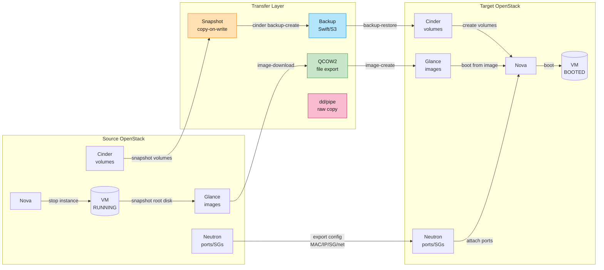
```mermaid
flowchart LR
    subgraph Source["Source OpenStack"]
        direction LR
        VM_S[(VM<br/>RUNNING)]
        Nova_S[Nova]
        Cinder_S[Cinder<br/>volumes]
        Glance_S[Glance<br/>images]
        Neutron_S[Neutron<br/>ports/SGs]
    end

    subgraph Transfer[Transfer Layer]
        direction TB
        Snap[Snapshot<br/>copy-on-write]
        Backup[Backup<br/>Swift/S3]
        QCOW2[QCOW2<br/>file export]
        Pipe[dd/pipe<br/>raw copy]
    end

    subgraph Target["Target OpenStack"]
        direction LR
        VM_T[(VM<br/>BOOTED)]
        Nova_T[Nova]
        Cinder_T[Cinder<br/>volumes]
        Glance_T[Glance<br/>images]
        Neutron_T[Neutron<br/>ports/SGs]
    end

    Nova_S -->|"stop instance"| VM_S
    VM_S -->|"snapshot root disk"| Glance_S
    Cinder_S -->|"snapshot volumes"| Snap
    Snap -->|"cinder backup-create"| Backup
    Backup -->|"backup-restore"| Cinder_T
    Glance_S -->|"image-download"| QCOW2
    QCOW2 -->|"image-create"| Glance_T
    Neutron_S -->|"export config<br/>MAC/IP/SG/net"| Neutron_T
    Cinder_T -->|"create volumes"| Nova_T
    Glance_T -->|"boot from image"| Nova_T
    Neutron_T -->|"attach ports"| Nova_T
    Nova_T -->|"boot"| VM_T

    style Snap fill:#ffe0b2,stroke:#f57c00,color:#1a1a1a
    style Backup fill:#b3e5fc,stroke:#0288d1,color:#1a1a1a
    style QCOW2 fill:#c8e6c9,stroke:#388e3c,color:#1a1a1a
    style Pipe fill:#f8bbd0,stroke:#c2185b,color:#1a1a1a
```

---

## 2. Network Migration L2 (Same Segment)

### 2.1 Sequence Diagram

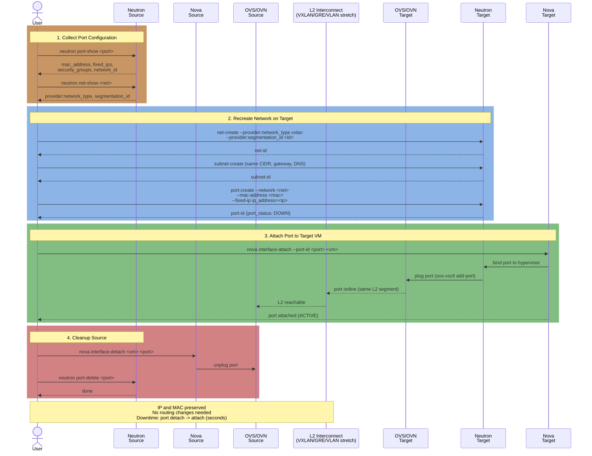
```mermaid
sequenceDiagram
    actor User
    participant NeutronSrc as Neutron<br/>Source
    participant NovaSrc as Nova<br/>Source
    participant OVS_Src as OVS/OVN<br/>Source
    participant L2_Fabric as L2 Interconnect<br/>(VXLAN/GRE/VLAN stretch)
    participant OVS_Tgt as OVS/OVN<br/>Target
    participant NeutronTgt as Neutron<br/>Target
    participant NovaTgt as Nova<br/>Target

    rect rgb(200, 150, 100)
        Note over User,NeutronSrc: 1. Collect Port Configuration
        User->>NeutronSrc: neutron port-show <port>
        NeutronSrc-->>User: mac_address, fixed_ips,<br/>security_groups, network_id
        User->>NeutronSrc: neutron net-show <net>
        NeutronSrc-->>User: provider:network_type, segmentation_id
    end

    rect rgb(140, 180, 230)
        Note over User,NeutronTgt: 2. Recreate Network on Target
        User->>NeutronTgt: net-create --provider:network_type vxlan<br/>--provider:segmentation_id <id>
        NeutronTgt-->>User: net-id
        User->>NeutronTgt: subnet-create (same CIDR, gateway, DNS)
        NeutronTgt-->>User: subnet-id
        User->>NeutronTgt: port-create --network <net><br/>--mac-address <mac><br/>--fixed-ip ip_address=<ip>
        NeutronTgt-->>User: port-id (port_status: DOWN)
    end

    rect rgb(130, 190, 130)
        Note over User,NovaTgt: 3. Attach Port to Target VM
        User->>NovaTgt: nova interface-attach --port-id <port> <vm>
        NovaTgt->>NeutronTgt: bind port to hypervisor
        NeutronTgt->>OVS_Tgt: plug port (ovs-vsctl add-port)
        OVS_Tgt-->>L2_Fabric: port online (same L2 segment)
        L2_Fabric-->>OVS_Src: L2 reachable
        NovaTgt-->>User: port attached (ACTIVE)
    end

    rect rgb(210, 130, 130)
        Note over User,NeutronSrc: 4. Cleanup Source
        User->>NovaSrc: nova interface-detach <vm> <port>
        NovaSrc->>OVS_Src: unplug port
        User->>NeutronSrc: neutron port-delete <port>
        NeutronSrc-->>User: done
    end

    Note over User,L2_Fabric: IP and MAC preserved<br/>No routing changes needed<br/>Downtime: port detach -> attach (seconds)
```

### 2.2 L2 Architecture

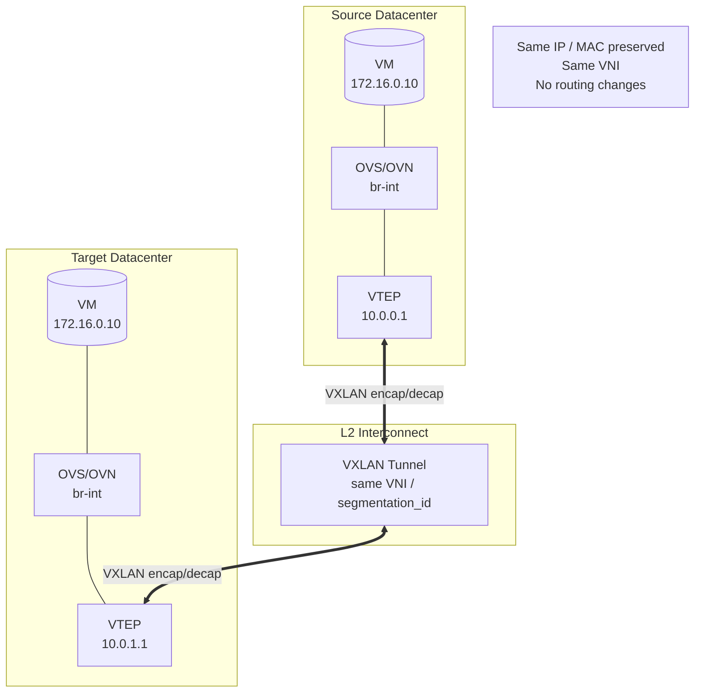
```mermaid
flowchart TB
    subgraph DC1["Source Datacenter"]
        VM_S[(VM<br/>172.16.0.10)]
        OVS_S[OVS/OVN<br/>br-int]
        VTEP_S[VTEP<br/>10.0.0.1]
        VM_S --- OVS_S --- VTEP_S
    end

    subgraph Fabric["L2 Interconnect"]
        VXLAN[VXLAN Tunnel<br/>same VNI / segmentation_id]
    end

    subgraph DC2["Target Datacenter"]
        VM_T[(VM<br/>172.16.0.10)]
        OVS_T[OVS/OVN<br/>br-int]
        VTEP_T[VTEP<br/>10.0.1.1]
        VM_T --- OVS_T --- VTEP_T
    end

    VTEP_S <==>|"VXLAN encap/decap"| VXLAN
    VXLAN <==>|"VXLAN encap/decap"| VTEP_T

    Note1[Same IP / MAC preserved<br/>Same VNI<br/>No routing changes]
```

---

## 3. Network Migration L3 (Different Networks)

### 3.1 Sequence Diagram

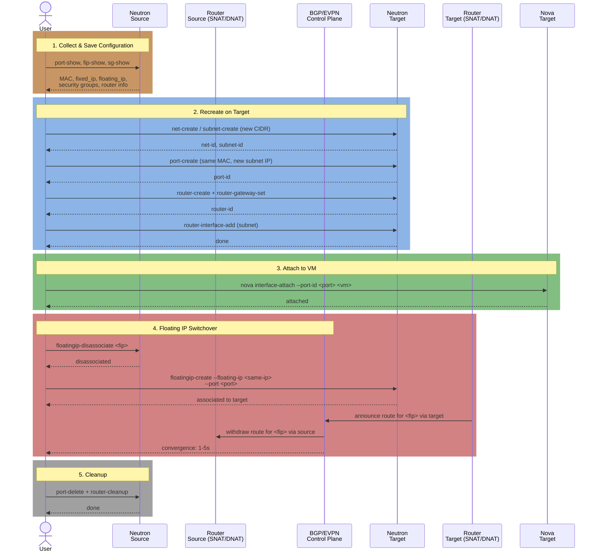
```mermaid
sequenceDiagram
    actor User
    participant NeutronSrc as Neutron<br/>Source
    participant RouterSrc as Router<br/>Source (SNAT/DNAT)
    participant BGP as BGP/EVPN<br/>Control Plane
    participant NeutronTgt as Neutron<br/>Target
    participant RouterTgt as Router<br/>Target (SNAT/DNAT)
    participant NovaTgt as Nova<br/>Target

    rect rgb(200, 150, 100)
        Note over User,NeutronSrc: 1. Collect & Save Configuration
        User->>NeutronSrc: port-show, fip-show, sg-show
        NeutronSrc-->>User: MAC, fixed_ip, floating_ip,<br/>security groups, router info
    end

    rect rgb(140, 180, 230)
        Note over User,NeutronTgt: 2. Recreate on Target
        User->>NeutronTgt: net-create / subnet-create (new CIDR)
        NeutronTgt-->>User: net-id, subnet-id
        User->>NeutronTgt: port-create (same MAC, new subnet IP)
        NeutronTgt-->>User: port-id
        User->>NeutronTgt: router-create + router-gateway-set
        NeutronTgt-->>User: router-id
        User->>NeutronTgt: router-interface-add (subnet)
        NeutronTgt-->>User: done
    end

    rect rgb(130, 190, 130)
        Note over User,NovaTgt: 3. Attach to VM
        User->>NovaTgt: nova interface-attach --port-id <port> <vm>
        NovaTgt-->>User: attached
    end

    rect rgb(210, 130, 130)
        Note over User,BGP: 4. Floating IP Switchover
        User->>NeutronSrc: floatingip-disassociate <fip>
        NeutronSrc-->>User: disassociated
        User->>NeutronTgt: floatingip-create --floating-ip <same-ip><br/>--port <port>
        NeutronTgt-->>User: associated to target

        RouterTgt->>BGP: announce route for <fip> via target
        BGP->>RouterSrc: withdraw route for <fip> via source
        BGP-->>User: convergence: 1-5s
    end

    rect rgb(160, 160, 160)
        Note over User,NeutronSrc: 5. Cleanup
        User->>NeutronSrc: port-delete + router-cleanup
        NeutronSrc-->>User: done
    end
```

### 3.2 L3 Architecture (BGP EVPN)

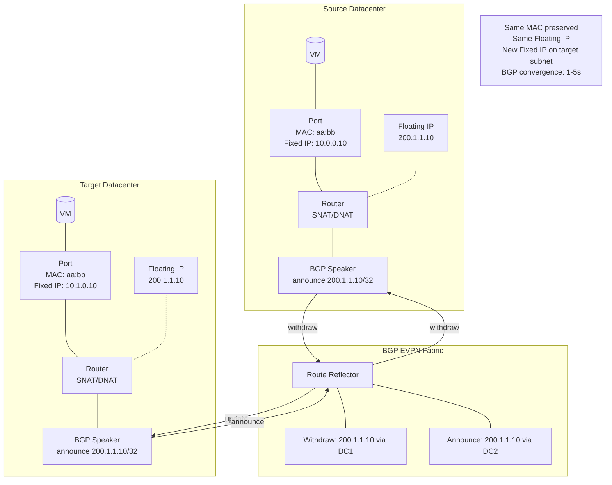
```mermaid
flowchart TB
    subgraph DC1["Source Datacenter"]
        direction LR
        VM_S[(VM)]
        Port_S[Port<br/>MAC: aa:bb<br/>Fixed IP: 10.0.0.10]
        FIP_S[Floating IP<br/>200.1.1.10]
        Router_S[Router<br/>SNAT/DNAT]
        BGP_S[BGP Speaker<br/>announce 200.1.1.10/32]
        VM_S --- Port_S --- Router_S
        FIP_S -.- Router_S
        Router_S --- BGP_S
    end

    subgraph WAN["BGP EVPN Fabric"]
        RR[Route Reflector]
        Update1["Withdraw: 200.1.1.10 via DC1"]
        Update2["Announce: 200.1.1.10 via DC2"]
        RR --- Update1
        RR --- Update2
    end

    subgraph DC2["Target Datacenter"]
        direction LR
        VM_T[(VM)]
        Port_T[Port<br/>MAC: aa:bb<br/>Fixed IP: 10.1.0.10]
        FIP_T[Floating IP<br/>200.1.1.10]
        Router_T[Router<br/>SNAT/DNAT]
        BGP_T[BGP Speaker<br/>announce 200.1.1.10/32]
        VM_T --- Port_T --- Router_T
        FIP_T -.- Router_T
        Router_T --- BGP_T
    end

    BGP_S -->|"withdraw"| RR
    RR -->|"update"| BGP_T
    BGP_T -->|"announce"| RR
    RR -->|"withdraw"| BGP_S

    Note1[Same MAC preserved<br/>Same Floating IP<br/>New Fixed IP on target subnet<br/>BGP convergence: 1-5s]
```

---

## 4. Live Migration (Hot Migration)

### 4.1 Sequence Diagram

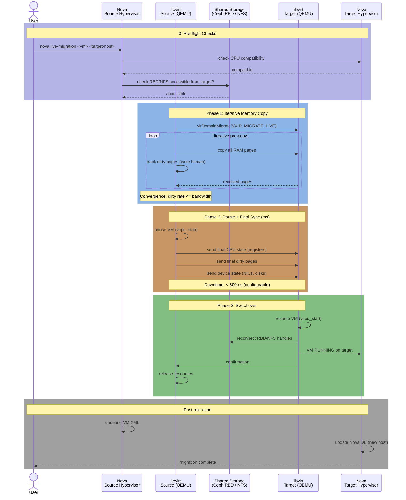
```mermaid
sequenceDiagram
    actor User
    participant NovaSrc as Nova<br/>Source Hypervisor
    participant LibvirtSrc as libvirt<br/>Source (QEMU)
    participant SharedStorage as Shared Storage<br/>(Ceph RBD / NFS)
    participant LibvirtTgt as libvirt<br/>Target (QEMU)
    participant NovaTgt as Nova<br/>Target Hypervisor

    rect rgb(180, 180, 230)
        Note over User,NovaTgt: 0. Pre-flight Checks
        User->>NovaSrc: nova live-migration <vm> <target-host>
        NovaSrc->>NovaTgt: check CPU compatibility
        NovaTgt-->>NovaSrc: compatible
        NovaSrc->>SharedStorage: check RBD/NFS accessible from target?
        SharedStorage-->>NovaSrc: accessible
    end

    rect rgb(140, 180, 230)
        Note over LibvirtSrc,LibvirtTgt: Phase 1: Iterative Memory Copy
        LibvirtSrc->>LibvirtTgt: virDomainMigrate3(VIR_MIGRATE_LIVE)
        loop Iterative pre-copy
            LibvirtSrc->>LibvirtTgt: copy all RAM pages
            LibvirtSrc->>LibvirtSrc: track dirty pages (write bitmap)
            LibvirtTgt-->>LibvirtSrc: received pages
        end
        Note over LibvirtSrc: Convergence: dirty rate <= bandwidth
    end

    rect rgb(200, 150, 100)
        Note over LibvirtSrc,LibvirtTgt: Phase 2: Pause + Final Sync (ms)
        LibvirtSrc->>LibvirtSrc: pause VM (vcpu_stop)
        LibvirtSrc->>LibvirtTgt: send final CPU state (registers)
        LibvirtSrc->>LibvirtTgt: send final dirty pages
        LibvirtSrc->>LibvirtTgt: send device state (NICs, disks)
        Note over LibvirtSrc,LibvirtTgt: Downtime: < 500ms (configurable)
    end

    rect rgb(130, 190, 130)
        Note over LibvirtSrc,LibvirtTgt: Phase 3: Switchover
        LibvirtTgt->>LibvirtTgt: resume VM (vcpu_start)
        LibvirtTgt->>SharedStorage: reconnect RBD/NFS handles
        LibvirtTgt-->>NovaTgt: VM RUNNING on target
        LibvirtTgt->>LibvirtSrc: confirmation
        LibvirtSrc->>LibvirtSrc: release resources
    end

    rect rgb(160, 160, 160)
        Note over User,NovaTgt: Post-migration
        NovaSrc->>NovaSrc: undefine VM XML
        NovaTgt->>NovaTgt: update Nova DB (new host)
        NovaTgt-->>User: migration complete
    end
```

### 4.2 Live Migration Architecture

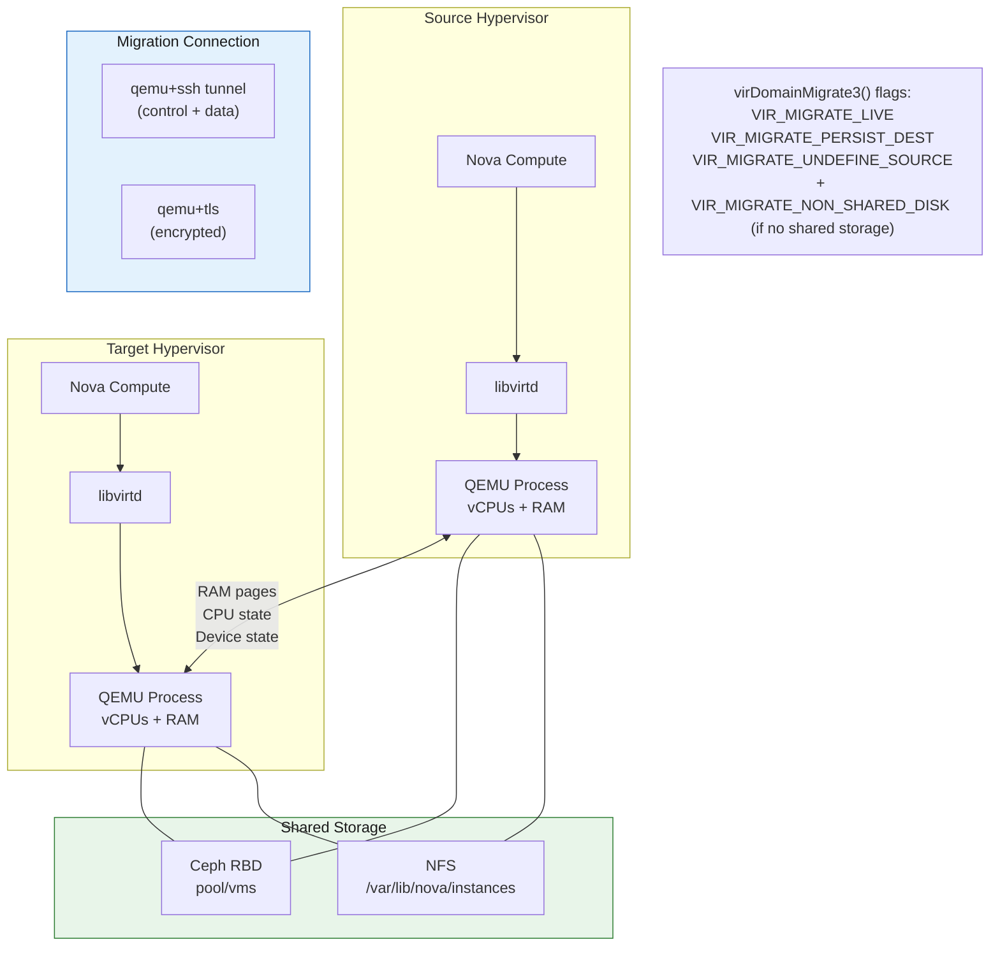
```mermaid
flowchart TB
    subgraph SourceHost["Source Hypervisor"]
        direction TB
        QEMU_S[QEMU Process<br/>vCPUs + RAM]
        Libvirt_S[libvirtd]
        Nova_S[Nova Compute]
        Nova_S --> Libvirt_S --> QEMU_S
    end

    subgraph Migration["Migration Connection"]
        direction LR
        SSH_Tunnel["qemu+ssh tunnel<br/>(control + data)"]
        TLS_Tunnel["qemu+tls<br/>(encrypted)"]
    end

    subgraph TargetHost["Target Hypervisor"]
        direction TB
        QEMU_T[QEMU Process<br/>vCPUs + RAM]
        Libvirt_T[libvirtd]
        Nova_T[Nova Compute]
        Nova_T --> Libvirt_T --> QEMU_T
    end

    subgraph Storage["Shared Storage"]
        Ceph[Ceph RBD<br/>pool/vms]
        NFS[NFS<br/>/var/lib/nova/instances]
    end

    QEMU_S <-->|"RAM pages<br/>CPU state<br/>Device state"| QEMU_T
    QEMU_S --- Ceph
    QEMU_T --- Ceph
    QEMU_S --- NFS
    QEMU_T --- NFS

    Flags["virDomainMigrate3() flags:<br/>VIR_MIGRATE_LIVE<br/>VIR_MIGRATE_PERSIST_DEST<br/>VIR_MIGRATE_UNDEFINE_SOURCE<br/>+ VIR_MIGRATE_NON_SHARED_DISK (if no shared storage)"]

    style Migration fill:#e3f2fd,stroke:#1565c0,color:#1a1a1a
    style Storage fill:#e8f5e9,stroke:#2e7d32,color:#1a1a1a
```

---

## 5. Storage Migration (Volume Transfer)

### 5.1 Sequence Diagram

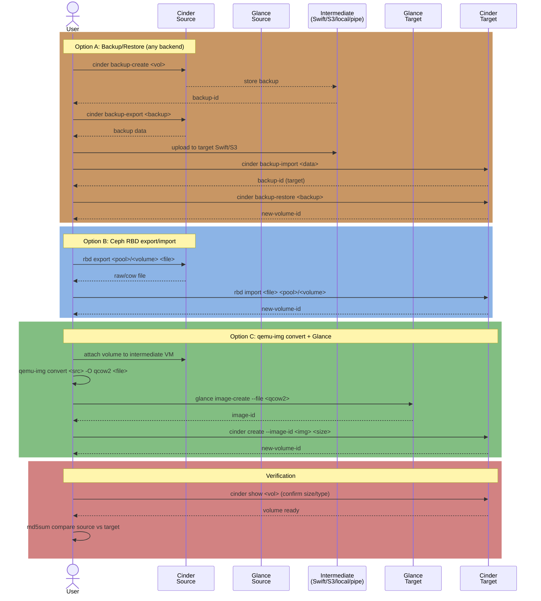
```mermaid
sequenceDiagram
    actor User
    participant CinderSrc as Cinder<br/>Source
    participant GlanceSrc as Glance<br/>Source
    participant Intermediate as Intermediate<br/>(Swift/S3/local/pipe)
    participant GlanceTgt as Glance<br/>Target
    participant CinderTgt as Cinder<br/>Target

    rect rgb(200, 150, 100)
        Note over User,CinderSrc: Option A: Backup/Restore (any backend)
        User->>CinderSrc: cinder backup-create <vol>
        CinderSrc-->>Intermediate: store backup
        Intermediate-->>User: backup-id
        User->>CinderSrc: cinder backup-export <backup>
        CinderSrc-->>User: backup data
        User->>Intermediate: upload to target Swift/S3
        User->>CinderTgt: cinder backup-import <data>
        CinderTgt-->>User: backup-id (target)
        User->>CinderTgt: cinder backup-restore <backup>
        CinderTgt-->>User: new-volume-id
    end

    rect rgb(140, 180, 230)
        Note over User,CinderSrc: Option B: Ceph RBD export/import
        User->>CinderSrc: rbd export <pool>/<volume> <file>
        CinderSrc-->>User: raw/cow file
        User->>CinderTgt: rbd import <file> <pool>/<volume>
        CinderTgt-->>User: new-volume-id
    end

    rect rgb(130, 190, 130)
        Note over User,CinderTgt: Option C: qemu-img convert + Glance
        User->>CinderSrc: attach volume to intermediate VM
        User->>User: qemu-img convert <src> -O qcow2 <file>
        User->>GlanceTgt: glance image-create --file <qcow2>
        GlanceTgt-->>User: image-id
        User->>CinderTgt: cinder create --image-id <img> <size>
        CinderTgt-->>User: new-volume-id
    end

    rect rgb(210, 130, 130)
        Note over User,CinderTgt: Verification
        User->>CinderTgt: cinder show <vol> (confirm size/type)
        CinderTgt-->>User: volume ready
        User->>User: md5sum compare source vs target
    end
```

### 5.2 Storage Transfer Variants

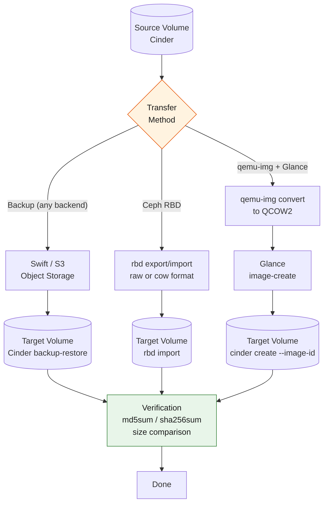
```mermaid
flowchart TB
    SourceVol[(Source Volume<br/>Cinder)]
    
    SourceVol --> Method{Transfer<br/>Method}
    
    Method -->|"Backup (any backend)"| Backup[Swift / S3<br/>Object Storage]
    Method -->|"Ceph RBD"| RBD[rbd export/import<br/>raw or cow format]
    Method -->|"qemu-img + Glance"| QEMU[qemu-img convert<br/>to QCOW2]
    
    Backup --> Target1[(Target Volume<br/>Cinder backup-restore)]
    RBD --> Target2[(Target Volume<br/>rbd import)]
    QEMU --> GlanceTarget[Glance<br/>image-create]
    GlanceTarget --> Target3[(Target Volume<br/>cinder create --image-id)]
    
    Target1 --> Verify["Verification<br/>md5sum / sha256sum<br/>size comparison"]
    Target2 --> Verify
    Target3 --> Verify
    
    Verify --> Done[Done]

    style Method fill:#fff3e0,stroke:#e65100,color:#1a1a1a
    style Verify fill:#e8f5e9,stroke:#2e7d32,color:#1a1a1a
```

---

## 6. Migration Context Overview

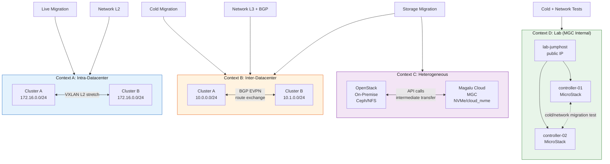
```mermaid
flowchart TB
    subgraph IntraDC["Context A: Intra-Datacenter"]
        direction LR
        ClusA[Cluster A<br/>172.16.0.0/24]
        ClusB[Cluster B<br/>172.16.0.0/24]
        ClusA <-->|"VXLAN L2 stretch"| ClusB
    end

    subgraph InterDC["Context B: Inter-Datacenter"]
        direction LR
        ClusC[Cluster A<br/>10.0.0.0/24]
        ClusD[Cluster B<br/>10.1.0.0/24]
        ClusC <-->|"BGP EVPN<br/>route exchange"| ClusD
    end

    subgraph Hybrid["Context C: Heterogeneous"]
        direction LR
        OnPrem[OpenStack<br/>On-Premise<br/>Ceph/NFS]
        MGC[Magalu Cloud<br/>MGC<br/>NVMe/cloud_nvme]
        OnPrem <-->|"API calls<br/>intermediate transfer"| MGC
    end

    subgraph Lab["Context D: Lab (MGC Internal)"]
        direction TB
        Jump[lab-jumphost<br/>public IP]
        Ctrl1[controller-01<br/>MicroStack]
        Ctrl2[controller-02<br/>MicroStack]
        Jump --> Ctrl1
        Jump --> Ctrl2
        Ctrl1 <-.->|"cold/network migration test"| Ctrl2
    end

    LiveMigration[Live Migration] --> IntraDC
    NetworkL2[Network L2] --> IntraDC
    ColdMigration[Cold Migration] --> InterDC
    NetworkL3[Network L3 + BGP] --> InterDC
    StorageMig[Storage Migration] --> Hybrid
    StorageMig --> InterDC
    ColdTest[Cold + Network Tests] --> Lab

    style IntraDC fill:#e3f2fd,stroke:#1565c0,color:#1a1a1a
    style InterDC fill:#fff3e0,stroke:#e65100,color:#1a1a1a
    style Hybrid fill:#f3e5f5,stroke:#7b1fa2,color:#1a1a1a
    style Lab fill:#e8f5e9,stroke:#2e7d32,color:#1a1a1a
```

---

## 7. Decision Matrix

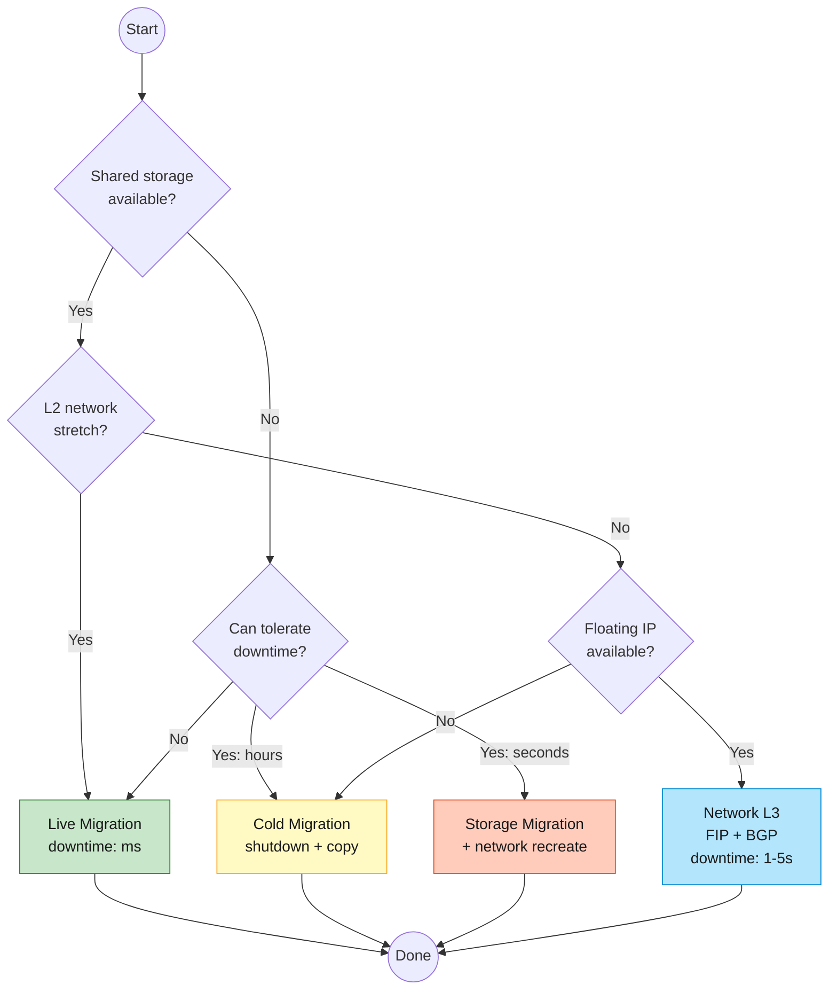
```mermaid
flowchart TD
    Start((Start)) --> Q1{Shared storage<br/>available?}
    
    Q1 -->|Yes| Q2{L2 network<br/>stretch?}
    Q1 -->|No| Q3{Can tolerate<br/>downtime?}
    
    Q2 -->|Yes| Live[Live Migration<br/>downtime: ms]
    Q2 -->|No| Q4{Floating IP<br/>available?}
    
    Q3 -->|Yes: hours| Cold[Cold Migration<br/>shutdown + copy]
    Q3 -->|Yes: seconds| StoragePlus[Storage Migration<br/>+ network recreate]
    Q3 -->|No| Live
    
    Q4 -->|Yes| NetworkL3_[Network L3<br/>FIP + BGP<br/>downtime: 1-5s]
    Q4 -->|No| Cold
    
    Live --> Done((Done))
    Cold --> Done
    StoragePlus --> Done
    NetworkL3_ --> Done

    style Live fill:#c8e6c9,stroke:#2e7d32,color:#1a1a1a
    style Cold fill:#fff9c4,stroke:#f9a825,color:#1a1a1a
    style StoragePlus fill:#ffccbc,stroke:#e64a19,color:#1a1a1a
    style NetworkL3_ fill:#b3e5fc,stroke:#0288d1,color:#1a1a1a
```

---

## 8. High-Level Flow Overviews

### 8.1 Cold Migration

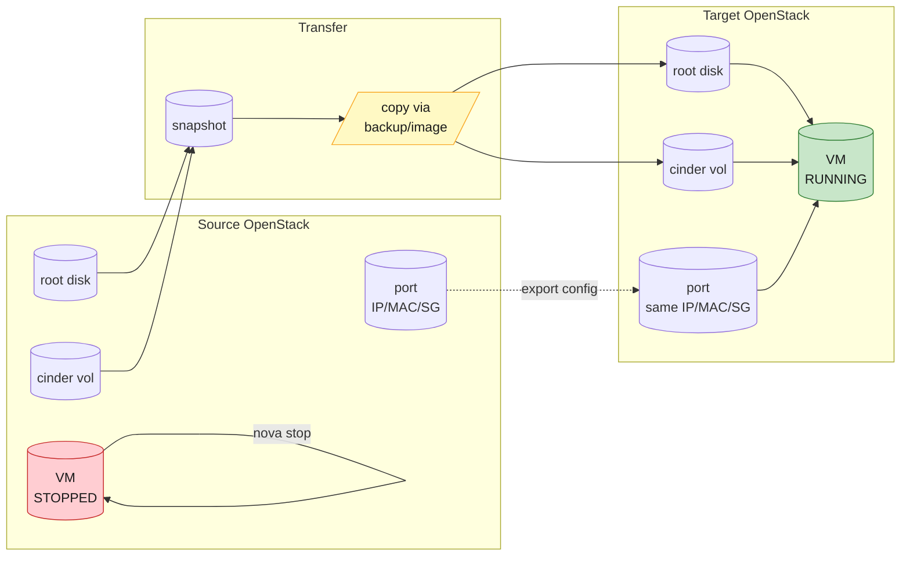
```mermaid
flowchart LR
    subgraph Source["Source OpenStack"]
        VM1[("VM<br/>STOPPED")]
        Disk1[(root disk)]
        Vol1[(cinder vol)]
        Net1[("port<br/>IP/MAC/SG")]
    end

    subgraph Transfer["Transfer"]
        Snap[(snapshot)]
        Copy[/"copy via<br/>backup/image"/]
    end

    subgraph Target["Target OpenStack"]
        VM2[("VM<br/>RUNNING")]
        Disk2[(root disk)]
        Vol2[(cinder vol)]
        Net2[("port<br/>same IP/MAC/SG")]
    end

    VM1 -->|"nova stop"| VM1
    Disk1 --> Snap --> Copy
    Vol1 --> Snap
    Copy --> Disk2
    Copy --> Vol2
    Net1 -.->|"export config"| Net2
    Disk2 --> VM2
    Vol2 --> VM2
    Net2 --> VM2

    style VM1 fill:#ffcdd2,stroke:#c62828,color:#1a1a1a
    style VM2 fill:#c8e6c9,stroke:#2e7d32,color:#1a1a1a
    style Copy fill:#fff9c4,stroke:#f9a825,color:#1a1a1a
```

### 8.2 Network Migration — L2

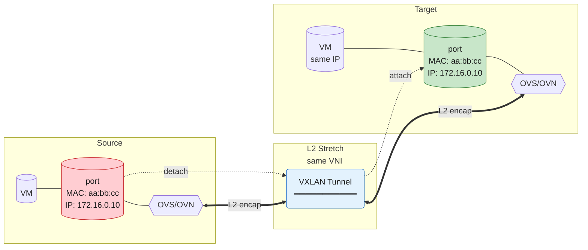
```mermaid
flowchart LR
    subgraph Source["Source"]
        VM1[("VM")]
        Port1[("port<br/>MAC: aa:bb:cc<br/>IP: 172.16.0.10")]
        OVS1{{"OVS/OVN"}}
        VM1 --- Port1 --- OVS1
    end

    subgraph Fabric["L2 Stretch<br/>same VNI"]
        VXLAN("VXLAN Tunnel<br/>═══════════")
    end

    subgraph Target["Target"]
        VM2[("VM<br/>same IP")]
        Port2[("port<br/>MAC: aa:bb:cc<br/>IP: 172.16.0.10")]
        OVS2{{"OVS/OVN"}}
        VM2 --- Port2 --- OVS2
    end

    Port1 -.->|"detach"| VXLAN
    VXLAN -.->|"attach"| Port2
    OVS1 <==>|"L2 encap"| VXLAN
    VXLAN <==>|"L2 encap"| OVS2

    style Port1 fill:#ffcdd2,stroke:#c62828,color:#1a1a1a
    style Port2 fill:#c8e6c9,stroke:#2e7d32,color:#1a1a1a
    style VXLAN fill:#e3f2fd,stroke:#1565c0,color:#1a1a1a
```

### 8.3 Network Migration — L3

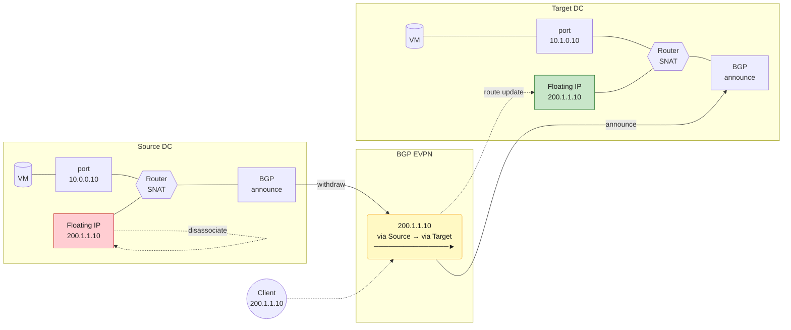
```mermaid
flowchart LR
    subgraph Source["Source DC"]
        direction TB
        VM1[("VM")]
        Port1["port<br/>10.0.0.10"]
        Router1{{"Router<br/>SNAT"}}
        FIP1["Floating IP<br/>200.1.1.10"]
        BGP1["BGP<br/>announce"]
        VM1 --- Port1 --- Router1
        FIP1 --- Router1 --- BGP1
    end

    subgraph Control["BGP EVPN"]
        ROUTE("200.1.1.10<br/>via Source → via Target<br/>───────────────►")
    end

    subgraph Target["Target DC"]
        direction TB
        VM2[("VM")]
        Port2["port<br/>10.1.0.10"]
        Router2{{"Router<br/>SNAT"}}
        FIP2["Floating IP<br/>200.1.1.10"]
        BGP2["BGP<br/>announce"]
        VM2 --- Port2 --- Router2
        FIP2 --- Router2 --- BGP2
    end

    FIP1 -.->|"disassociate"| FIP1
    ROUTE -.->|"route update"| FIP2
    BGP1 -->|"withdraw"| ROUTE
    ROUTE -->|"announce"| BGP2
    Client(("Client<br/>200.1.1.10")) -.-> ROUTE

    style FIP1 fill:#ffcdd2,stroke:#c62828,color:#1a1a1a
    style FIP2 fill:#c8e6c9,stroke:#2e7d32,color:#1a1a1a
    style ROUTE fill:#fff9c4,stroke:#f9a825,color:#1a1a1a
```

### 8.4 Live Migration

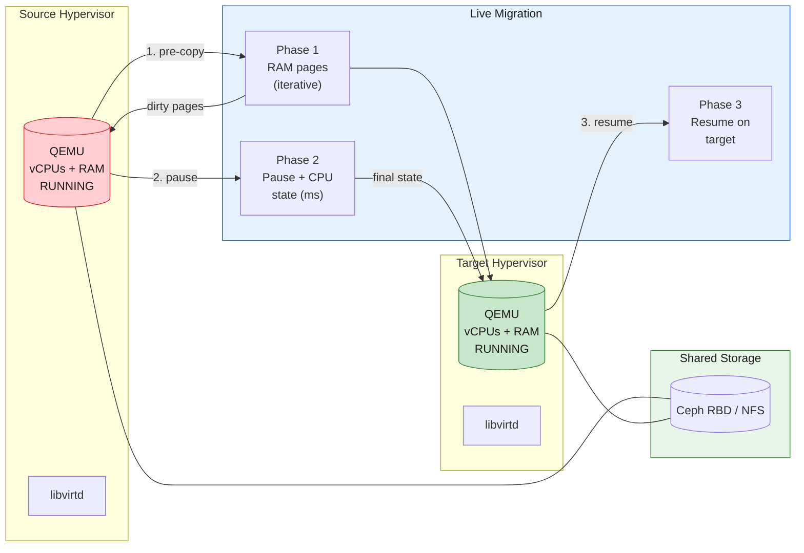
```mermaid
flowchart LR
    subgraph SourceHost["Source Hypervisor"]
        QEMU1[("QEMU<br/>vCPUs + RAM<br/>RUNNING")]
        Libvirt1[libvirtd]
    end

    subgraph Migration["Live Migration"]
        PH1["Phase 1<br/>RAM pages<br/>(iterative)"]
        PH2["Phase 2<br/>Pause + CPU<br/>state (ms)"]
        PH3["Phase 3<br/>Resume on<br/>target"]
    end

    subgraph TargetHost["Target Hypervisor"]
        QEMU2[("QEMU<br/>vCPUs + RAM<br/>RUNNING")]
        Libvirt2[libvirtd]
    end

    subgraph Storage["Shared Storage"]
        RBD[("Ceph RBD / NFS")]
    end

    QEMU1 -->|"1. pre-copy"| PH1
    PH1 -->|"dirty pages"| QEMU1
    PH1 --> QEMU2
    QEMU1 -->|"2. pause"| PH2
    PH2 -->|"final state"| QEMU2
    QEMU2 -->|"3. resume"| PH3
    QEMU1 --- RBD
    QEMU2 --- RBD

    style QEMU1 fill:#ffcdd2,stroke:#c62828,color:#1a1a1a
    style QEMU2 fill:#c8e6c9,stroke:#2e7d32,color:#1a1a1a
    style Migration fill:#e3f2fd,stroke:#1565c0,color:#1a1a1a
    style Storage fill:#e8f5e9,stroke:#2e7d32,color:#1a1a1a
```

### 8.5 Storage Migration

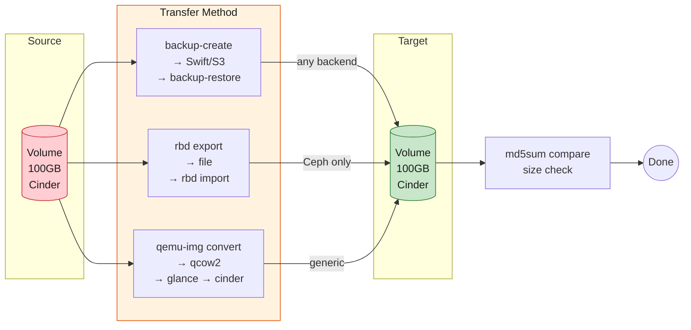
```mermaid
flowchart LR
    subgraph Source["Source"]
        Vol1[("Volume<br/>100GB<br/>Cinder")]
    end

    subgraph Method["Transfer Method"]
        direction TB
        M1["backup-create<br/>→ Swift/S3<br/>→ backup-restore"]
        M2["rbd export<br/>→ file<br/>→ rbd import"]
        M3["qemu-img convert<br/>→ qcow2<br/>→ glance → cinder"]
    end

    subgraph Target["Target"]
        Vol2[("Volume<br/>100GB<br/>Cinder")]
    end

    Vol1 --> M1
    Vol1 --> M2
    Vol1 --> M3
    M1 -->|"any backend"| Vol2
    M2 -->|"Ceph only"| Vol2
    M3 -->|"generic"| Vol2

    Verify["md5sum compare<br/>size check"]
    Vol2 --> Verify --> Done(("Done"))

    style Vol1 fill:#ffcdd2,stroke:#c62828,color:#1a1a1a
    style Vol2 fill:#c8e6c9,stroke:#2e7d32,color:#1a1a1a
    style Method fill:#fff3e0,stroke:#e65100,color:#1a1a1a
```

### 8.6 All Flow Comparison

```mermaid
flowchart TB
    subgraph Cold["Cold Migration"]
        direction LR
        C1[("VM<br/>STOP")] --> C2[/"copy<br/>disk+net"/] --> C3[("VM<br/>START")]
    end

    subgraph NetL2["Network L2"]
        direction LR
        N1[("port<br/>MAC")] --> N2[/"L2 stretch<br/>reattach"/] --> N3[("port<br/>same MAC/IP")]
    end

    subgraph NetL3["Network L3 + BGP"]
        direction LR
        L1[("FIP<br/>source")] --> L2[/"BGP<br/>update"/] --> L3[("FIP<br/>target")]
    end

    subgraph Live["Live Migration"]
        direction LR
        LV1[("VM<br/>RUN src")] --> LV2[/"RAM+CPU<br/>state copy"/] --> LV3[("VM<br/>RUN tgt")]
    end

    subgraph StorageM["Storage Migration"]
        direction LR
        S1[("volume<br/>source")] --> S2[/"backup<br/>export/import"/] --> S3[("volume<br/>target")]
    end

    Cold --- DT1["Downtime: min/hours"]
    NetL2 --- DT2["Downtime: seconds"]
    NetL3 --- DT3["Downtime: 1-5s"]
    Live --- DT4["Downtime: ms"]
    StorageM --- DT5["Downtime: min/hours"]

    style Cold fill:#fff9c4,stroke:#f9a825,color:#1a1a1a
    style NetL2 fill:#b3e5fc,stroke:#0288d1,color:#1a1a1a
    style NetL3 fill:#e1bee7,stroke:#7b1fa2,color:#1a1a1a
    style Live fill:#c8e6c9,stroke:#2e7d32,color:#1a1a1a
    style StorageM fill:#ffccbc,stroke:#e64a19,color:#1a1a1a
```

---

## 9. High-Level Representative Diagrams

### 9.1 Cold Migration — Shutdown, Copy, Boot

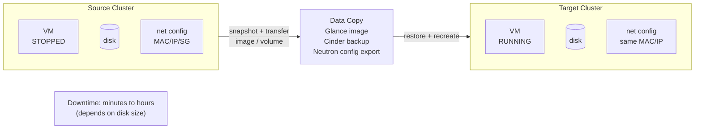
```mermaid
flowchart LR
    subgraph S["Source Cluster"]
        VS["VM<br/>STOPPED"]
        DS[("disk")]
        NS["net config<br/>MAC/IP/SG"]
    end

    S -->|"snapshot + transfer<br/>image / volume"| M

    M["Data Copy<br/>Glance image<br/>Cinder backup<br/>Neutron config export"]

    M -->|"restore + recreate"| T

    subgraph T["Target Cluster"]
        VT["VM<br/>RUNNING"]
        DT[("disk")]
        NT["net config<br/>same MAC/IP"]
    end

    Downtime["Downtime: minutes to hours<br/>(depends on disk size)"]
```

### 9.2 Network Migration L2 — Port Moves, Same Network

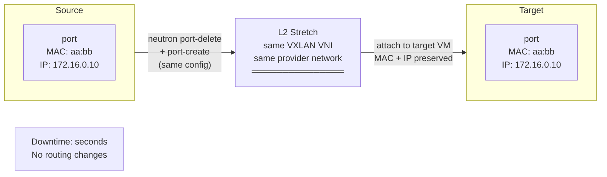
```mermaid
flowchart LR
    subgraph S["Source"]
        PS["port<br/>MAC: aa:bb<br/>IP: 172.16.0.10"]
    end

    S -->|"neutron port-delete<br/>+ port-create<br/>(same config)"| L2

    L2["L2 Stretch<br/>same VXLAN VNI<br/>same provider network<br/>═══════════════"]

    L2 -->|"attach to target VM<br/>MAC + IP preserved"| T

    subgraph T["Target"]
        PT["port<br/>MAC: aa:bb<br/>IP: 172.16.0.10"]
    end

    Downtime["Downtime: seconds<br/>No routing changes"]
```

### 9.3 Network Migration L3 — Floating IP + BGP

```mermaid
flowchart LR
    subgraph S["Source DC"]
        FS["Floating IP<br/>200.1.1.10<br/>via Source"]
    end

    S -->|"1. disassociate FIP"| FIP

    FIP["Floating IP<br/>200.1.1.10<br/>released"]

    FIP -->|"2. reassociate FIP<br/>on target router"| T

    subgraph T["Target DC"]
        FT["Floating IP<br/>200.1.1.10<br/>via Target"]
    end

    BGP["BGP EVPN<br/>withdraw from source<br/>announce via target<br/>convergence: 1-5s"]
    S --> BGP
    BGP --> T

    Downtime["Downtime: 1-5s<br/>(BGP convergence)"]
```

### 9.4 Live Migration — VM Moves While Running

```mermaid
flowchart LR
    subgraph Src["Source Hypervisor"]
        QS[("QEMU<br/>VM RUNNING<br/>vCPUs + RAM")]
    end

    Src -->|"1. iterative pre-copy<br/>RAM pages while VM runs"| Mig

    Mig["Live Migration<br/>virDomainMigrate3()<br/>VIR_MIGRATE_LIVE"]

    Mig -->|"2. final pause (ms)<br/>CPU + dirty pages"| Tgt

    subgraph Tgt["Target Hypervisor"]
        QT[("QEMU<br/>VM RUNNING<br/>vCPUs + RAM")]
    end

    subgraph St["Shared Storage"]
        ST[(Ceph RBD / NFS)]
    end

    Src --- St
    Tgt --- St

    Downtime["Downtime: milliseconds<br/>Same IP, same storage"]
```

### 9.5 Storage Migration — Volume Data Only

```mermaid
flowchart LR
    subgraph S["Source"]
        V1[("Volume<br/>100GB")]
    end

    S -->|"method"| M

    M["Transfer Method<br/>┌─────────────────────┐<br/>│ backup → Swift/S3   │<br/>│ rbd export/import    │<br/>│ qemu-img → Glance   │<br/>└─────────────────────┘"]

    M -->|"restore"| T

    subgraph T["Target"]
        V2[("Volume<br/>100GB")]
    end

    V1 -.->|"md5sum verify"| V2
    Downtime["Downtime: minutes to hours<br/>Instance recreated separately"]
```

### 9.6 All Flows — Quick Comparison

```mermaid
flowchart TB
    title["OpenStack Inter-Cluster Migration Flows"]

    Cold["Cold Migration"] --> CD["Shutdown VM<br/>Copy disk + network<br/>Boot on target<br/>min/hours"]

    NetL2["Network L2"] --> L2D["Detach port source<br/>L2 stretch (VXLAN)<br/>Attach port target<br/>seconds"]

    NetL3["Network L3 + BGP"] --> L3D["Release Floating IP<br/>BGP route update<br/>Reassociate on target<br/>1-5s"]

    Live["Live Migration"] --> LD["Pre-copy RAM (iterative)<br/>Pause (ms) + CPU state<br/>Resume on target<br/>milliseconds"]

    StorageM["Storage Migration"] --> SD["Snapshot / backup<br/>Transfer data<br/>Restore volume<br/>min/hours"]

    style Cold fill:#fff9c4,stroke:#f9a825,color:#1a1a1a
    style NetL2 fill:#b3e5fc,stroke:#0288d1,color:#1a1a1a
    style NetL3 fill:#e1bee7,stroke:#7b1fa2,color:#1a1a1a
    style Live fill:#c8e6c9,stroke:#2e7d32,color:#1a1a1a
    style StorageM fill:#ffccbc,stroke:#e64a19,color:#1a1a1a
```
